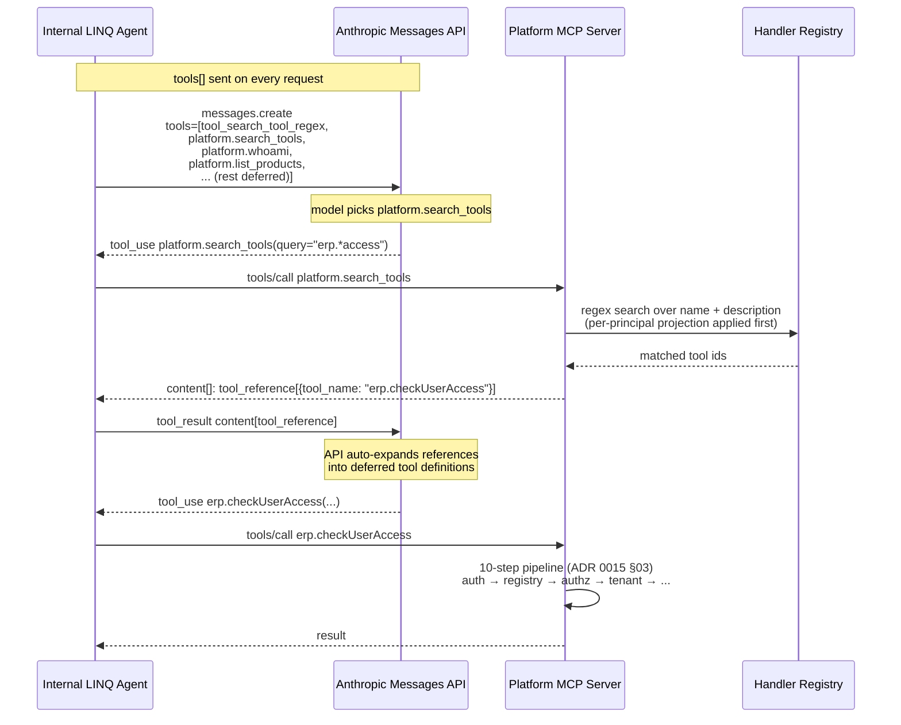

# Decision 0017 — Tool Search support for the platform MCP server

**Status:** Accepted (2026-05-05). Promoted from Proposed on 2026-05-05 — see [Status history](#status-history). Backed by [Decision 0015 — Centralized Platform MCP Server](0015-centralized-platform-mcp.md) and the design-space survey in [`docs/research/0017-tool-search-support/deep-dives/mcp-native-progressive-tool-discovery.md`](../research/0017-tool-search-support/deep-dives/mcp-native-progressive-tool-discovery.md).

## Context

The platform MCP server's V1 surface — read-only tools across ERP, CRM, DWH, and Support per [Decision 0015](0015-centralized-platform-mcp.md) — is targeted at 40–200 handlers in the first year and 200–2000 over three years. At ~400–500 tokens per tool definition, the full catalog crosses two well-documented failure modes well before the upper end of that range: tool-selection accuracy degrades sharply past 30–50 visible tools, and tool definitions consume a meaningful fraction of every Anthropic Messages API request's context window. Anthropic's [Tool Search Tool announcement](https://platform.claude.com/docs/en/agents-and-tools/tool-use/tool-search-tool) reports >85% token reduction on representative multi-server setups by deferring tool definitions until the model searches for them.

The platform MCP server today projects `tools/list` per principal (ADR 0015 R4) — a per-`client_id` filter that already shrinks the catalog. That handles the size problem when an agent only ever touches one product. It does not handle the size problem when a generalist agent like Claude Code internal could touch any product, and it does not address the tool-selection-accuracy cliff.

A 2026-05-05 Phase-1 research pass mapped the design space across two layers (Anthropic Messages API and the MCP protocol) and seven distinct mechanisms — Anthropic's GA Tool Search Tool, MCP cursor pagination, per-principal projection, and four open MCP Specification Enhancement Proposals (SEP-1821, SEP-1881, SEP-1888, plus Discussion #532). Of these, only the first three are production-shippable today; the SEPs are Draft, none sponsored. Full survey, including verbatim spec quotes and a watch-list for re-evaluation: [`mcp-native-progressive-tool-discovery.md`](../research/0017-tool-search-support/deep-dives/mcp-native-progressive-tool-discovery.md).

V1 scope is locked by [Decision 0015](0015-centralized-platform-mcp.md): internal LINQ agents only, **read-only**, 4 products, no formal compliance certification. There are no production agents pinned to the current behavior — V1 is greenfield.

## Decision

Adopt the **server-exposed custom-search-tool pattern, paired with client-side defer-loading guidance** as the platform MCP server's progressive-disclosure mechanism. The server adds three net-new platform-level tools to its catalog. One of them, `platform.search_tools`, returns `tool_reference[]` blocks per Anthropic's "Custom tool search implementation" hook, which is structurally identical to draft SEP-1888's `<library>.searchTools` pattern. Internal LINQ agents calling the Messages API mark every other tool with `defer_loading: true`. Non-Anthropic and pre-`defer_loading` clients ignore the deferral marker and receive the existing per-principal-projected `tools/list` — a clean, automatic fallback.

Specific binding choices:

- **Three new platform-level tools.** All in the `platform.*` namespace, all always-loaded (never deferred), all introduced by ADR 0017's seed registry items.
  - `platform.search_tools(query: string, limit?: number)` — returns up to 5 `tool_reference` blocks pointing at registry-projected tools whose `name` or `description` matches the regex query. Backs onto the existing handler registry; uses Python `re.search()` semantics (case-sensitive by default; `(?i)` available).
  - `platform.whoami()` — echoes the verified `sub`, `client_id`, `tenant_id`, scope set, and permission set. Cheap identity sanity-check used in nearly every session.
  - `platform.list_products()` — lists product namespaces the calling principal can see (`erp`, `crm`, `dwh`, `support`) so an agent knows what verb-prefixes the search-tool will accept. Derived from registry projection.
- **Search variant: regex (`tool_search_tool_regex_20251119` semantics).** ADR 0015's mandated `<product>.<verb>...` naming and `mcp-handler-lint` description-quality rules align well with prefix and substring regex queries (`^erp\..*`, `(?i)access`). BM25 reserved as a future option if user-prompted natural-language queries become the common case (revisit at M2 per Open Questions).
- **`tools/list` cursor pagination.** Implement the optional `cursor` request parameter and `nextCursor` response field per MCP `2025-06-18` for forward-compat with spec-compliant clients. Per-principal projection makes this non-urgent at V1 (≤40 tools per agent) but it is a one-time, low-cost addition.
- **Tool categorization.** Three tools always-loaded (`platform.search_tools`, `platform.whoami`, `platform.list_products`); every other tool in the catalog deferred. The 3-tool always-loaded ceiling matches Anthropic's "keep your 3–5 most frequently used tools as non-deferred" guidance.
- **Client compatibility.** Any MCP-spec-compliant client. Anthropic Claude 4.0+ clients use the full Tool Search Tool path with `defer_loading: true`. All other clients receive the per-principal-projected `tools/list` as before — `platform.search_tools` simply sits in the catalog as another invocable tool. No `Accept-Tool-Search` header. No `initialize`-handshake capability flag beyond what ADR 0015 already advertises.
- **No extra registry metadata.** Description-quality lint and namespace conventions are already enforced; adding `searchKeywords[]` or `category` fields is unjustified maintenance burden at V1. Revisit at M2 if recall measurements demand it.
- **Telemetry.** Extend the existing per-request audit record (ADR 0015 §Audit) with a single new field: `tools_loaded_via_search: string[]`. Default on; one extra string array per record on the audit code path. Drives tuning of tool descriptions and the regex search backend.
- **Authorization unchanged.** Authorization is enforced at `tools/call` time per the 10-step pipeline in [`03-mcp-server.md`](../research/0015-centralized-platform-mcp/implementation/03-mcp-server.md) §2.5 — Steps 3 (coarse-grained scope+permission), 4 (tenant-scope), 5 (input schema), 6 (read-only sideEffects gate), and the rate-limit, identity-broker, and STS steps. Deferred discovery via `platform.search_tools` cannot bypass any of them. ADR 0017 introduces no authorization seam of its own.
- **No feature flag.** The kill-switch is removing `platform.search_tools` from the registry — at which point the catalog reverts to flat `tools/list` projection. This composes with the existing CFN custom-resource seed pattern; no new ops surface.
- **Forward-compat alignment.** `platform.search_tools` is intentionally shaped to match draft SEP-1888's `<library>.searchTools` pattern. If SEP-1888 lands as written, the migration is renaming the registry seed item — not refactoring code. SEP-1821 (a `query` parameter on `tools/list`) and SEP-1881 (scope-filtered discovery, which LINQ already does in spirit) sit on the watch-list, re-evaluated at M2/M3.
- **Implementation lands in M1 Phase C.** The platform MCP server's M1 Phase C delivers `routes/tools-list.ts` and `routes/tools-call.ts` per [`03-mcp-server.md`](../research/0015-centralized-platform-mcp/implementation/03-mcp-server.md). ADR 0017's `routes/tools-search.ts` ships in the same module, in the same milestone, sharing the registry cache and audit emitter. Higher coupling, no rework.

The rejected alternatives, in brief: (a) **client-side-only docs** without a server-side search primitive — works for Anthropic-only clients but leaves non-Anthropic clients with no way to search, and forces every agent codebase to reimplement search filtering against a flat catalog; (b) **wait for the MCP-native SEPs** to land — speculative, no sponsor, indeterminate timeline, and SEP-1888's wire shape is achievable today through Anthropic's custom-search hook; (c) **per-principal projection alone** — already in ADR 0015 R4, and insufficient for generalist agents that touch multiple products. Full survey: [`mcp-native-progressive-tool-discovery.md`](../research/0017-tool-search-support/deep-dives/mcp-native-progressive-tool-discovery.md) §§4–7.

### Reference flow

## Consequences

- **Token cost on connect drops dramatically for Anthropic clients.** With three platform tools always-loaded (~1500 tokens) and the rest deferred, an agent connecting to a 200-handler V1 catalog pays roughly 1.5k tokens in tool definitions instead of ~80k. The savings scale linearly with catalog size; LINQ benefits more, not less, as the registry grows. (No quantified V1 projection in this ADR per Phase 1 Q10 disposition; the 85% claim is Anthropic's, cited above.)
- **Tool selection accuracy preserved past 30–50 tools.** The model sees three tools at the always-loaded layer and a focused 3–5 at the search-result layer. The Anthropic-documented accuracy cliff is sidestepped at V1's growth path.
- **No regression for non-Anthropic clients.** `tools/list` continues to return the per-principal-projected catalog. Any client that ignores `defer_loading` sees `platform.search_tools` as a normal tool plus the rest of its slice. Behavior is strictly additive.
- **Authorization seam unchanged.** Deferred discovery cannot bypass authorization because `tools/call` enforces it after-the-fact at every invocation. ADR 0017 introduces no exemption. Negative tests in the test plan below prove this for the 4 representative denial classes (`AGENT_SCOPE_DENIED`, `USER_PERMISSION_DENIED`, `TENANT_SCOPE_VIOLATION`, `WRITE_NOT_ALLOWED_V1`).
- **Audit grows by one string array per record.** Negligible CloudWatch volume. Useful for tuning tool descriptions if recall ever degrades.
- **One new dispatch path in M1 Phase C.** `routes/tools-search.ts` joins the existing list (`tools-list.ts`, `tools-call.ts`, `well-known.ts`). Shares the 5-min in-process registry cache; reuses `audit.ts` and `errors.ts`. No new dependencies; the registry already stores everything needed for substring/regex matching.
- **Watch-list cost is one quarterly review.** SEP-1821 / 1881 / 1888 status changes warrant re-evaluation; the deep-dive's watch-list section enumerates the trigger conditions.

### Phase-2 implementation

Lands in M1 Phase C of the platform MCP server (`linq-platform-mcp` repo). Tasks and ordering: [`docs/research/0017-tool-search-support/implementation-plan.md`](../research/0017-tool-search-support/implementation-plan.md) (to be authored as Phase 3 deliverable per the mission's gating).

Required tests:
- **Functional.** `platform.search_tools(query="erp.*")` returns ≤5 `tool_reference` blocks for an ERP-scoped principal; returns zero blocks for a query that matches no projected tool. Search is case-sensitive by default; `(?i)` works.
- **RBAC negative.** A principal whose registry projection excludes `erp.*` and who searches `erp.*` receives an empty result set — never the existence of an unauthorized tool. The result set is computed *after* per-principal projection.
- **Tenant-scope negative.** Searching for and discovering a tool does not bypass tenant-scope enforcement at `tools/call`. Cross-tenant invocation through a search-discovered tool returns `TENANT_SCOPE_VIOLATION` per ADR 0015 §AC3, with no `sts:AssumeRole` CloudTrail entry.
- **Read-only negative.** Any `sideEffects: "write"` registry item is unreachable; registry registration already rejects them per ADR 0015 §AC8.
- **Fallback.** A non-Anthropic MCP client receives the flat per-principal-projected catalog from `tools/list` (existing behavior). No `defer_loading` is honored on the wire — that flag never crosses the MCP layer.
- **Pagination.** `tools/list` with no cursor returns the first page; `nextCursor` round-trips correctly through one full traversal of a 100-item catalog. Empty `nextCursor` ends the page chain.
- **Audit.** Audit records for `tools/call` invocations following a successful `platform.search_tools` round include the discovered tool id in `tools_loaded_via_search[]`. Direct `tools/call` invocations leave the field empty.

### Open questions

- **BM25 vs. regex, M2 re-evaluation.** Regex serves V1's curated `<product>.<verb>` namespace well. If user-prompted natural-language queries dominate by M2, switch to BM25. Trigger: regex recall < 90% on a sampled query corpus.
- **`searchKeywords[]` registry field, M2 re-evaluation.** Held off in V1 per Phase 1 Q8. Revisit only if description-only matching produces measurable false-negatives.
- **MCP SEP watch-list (1821, 1881, 1888).** All Draft as of 2026-05-05, none sponsored. Re-evaluate at M2 and M3, or sooner if any reaches Sponsored / Accepted. Watch-list trigger conditions: see [deep-dive watch-list](../research/0017-tool-search-support/deep-dives/mcp-native-progressive-tool-discovery.md#watch-list--when-to-re-read-this-doc).

## Status history

| Date | Status | Notes |
|---|---|---|
| 2026-05-05 | Proposed | ADR drafted. Backed by Phase 1 research (mission-add-mcp-idempotent-tiger), the deep-dive at [`docs/research/0017-tool-search-support/deep-dives/mcp-native-progressive-tool-discovery.md`](../research/0017-tool-search-support/deep-dives/mcp-native-progressive-tool-discovery.md), and ADR 0015. Implementation plan (Phase 3) and code (Phase 4) gated on user approval per mission rules. |
| 2026-05-05 | Accepted | Promoted from Proposed on the same day. User approval recorded against the design and security analysis. Implementation plan authored at [`docs/research/0017-tool-search-support/implementation-plan.md`](../research/0017-tool-search-support/implementation-plan.md). Phase 4 (code in `linq-platform-mcp`) gated on plan approval. |

## Sources

- Anthropic Tool Search Tool docs — https://platform.claude.com/docs/en/agents-and-tools/tool-use/tool-search-tool
- MCP `2025-06-18` Tools section — https://modelcontextprotocol.io/specification/2025-06-18/server/tools
- MCP SEP-1821 (Dynamic Tool Discovery, Draft) — https://github.com/modelcontextprotocol/modelcontextprotocol/issues/1821
- MCP SEP-1881 (Scope-Filtered Tool Discovery, Draft) — https://github.com/modelcontextprotocol/modelcontextprotocol/issues/1881
- MCP SEP-1888 (Progressive Disclosure for Typed Library Discovery, Draft) — https://github.com/modelcontextprotocol/modelcontextprotocol/issues/1888
- LINQ knowledge base entity: [`mcp-tool-catalog`](../../knowledge/wiki/entities/mcp-tool-catalog.md).
- Upstream LINQ ADRs cited — [Decision 0015 (Centralized Platform MCP Server)](0015-centralized-platform-mcp.md), [Decision 0008 (MCP connectors — Atlassian)](0008-mcp-connectors.md), [Decision 0013 (knowledge-base three-layer pattern)](0013-karpathy-wiki-pattern.md), [Decision 0016 (AWS multi-account skill credentials)](0016-aws-multi-account-skill-credentials.md).
- Mission record: [`/Users/scarver/.claude/plans/mission-add-mcp-idempotent-tiger.md`](../../../.claude/plans/mission-add-mcp-idempotent-tiger.md) — Phase 1 research and locked answers (private to the mission's working tree; reproduced into this ADR's Context section).
