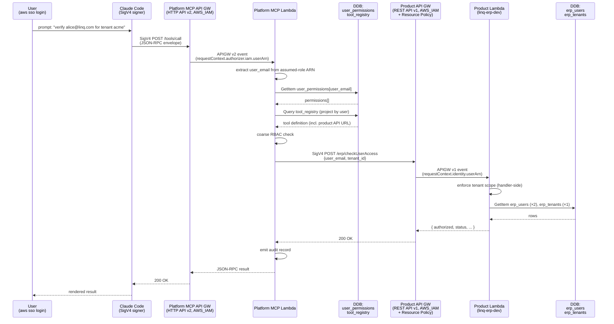

# Decision 0025 — LINQ Platform MCP Server (V1)

**Status:** Proposed (2026-05-06). Foundational research at [`docs/research/0025-platform-mcp-server/deep-dives/v1-auth-and-dispatch-research.md`](../research/0025-platform-mcp-server/deep-dives/v1-auth-and-dispatch-research.md).

## Context

LINQ wants an internal Platform MCP Server that lets Claude-Code-driven employees invoke read-only tools across LINQ products (ERP, CRM, and others as they onboard) under a single governance seam. The seam owns: per-user catalog projection, coarse role-based access control, per-request audit, and centralized cross-account dispatch.

The V1 scope is held tight to make it shippable in the hackathon window:

- **Internal employees only.** Authenticated via the company's AWS IAM Identity Center (AWS SSO).
- **Read-only tools.** No mutation paths in V1.
- **Human-driven via Claude Code.** No autonomous-agent code path.
- **The platform has no concept of tenant.** Some tools accept a tenant argument; if a user has permission to invoke a tool, they can invoke it for any tenant the tool accepts. Tenant scope (when a tool has one) is enforced at the handler.
- **One auth mechanism end-to-end** — SigV4 signatures over IAM-authenticated API Gateway calls, from the user's laptop all the way to the product handler. No JWTs, no token-exchange brokers.

The trust chain reduces to three legs:

1. **User → Platform MCP API Gateway.** User runs `aws sso login`, obtains short-lived STS credentials representing an assumed-role session. The MCP client SigV4-signs JSON-RPC requests to a same-account API Gateway with `AWS_IAM` auth. The API Gateway validates the signature; the route is invoked only if the user's IAM identity carries `execute-api:Invoke` permission for the route ARN.
2. **Platform MCP Lambda — extract user identity, project the catalog, enforce coarse RBAC.** The Lambda reads the assumed-role ARN from the API Gateway event, takes the trailing `role-session-name` as the user's email, looks up fine-grained permissions in a DynamoDB table, and applies the catalog projection + RBAC checks. The platform emits one audit record per request.
3. **Platform MCP Lambda → per-product API Gateway.** The Lambda SigV4-signs an HTTPS POST to a REST API Gateway (v1) in the product AWS account, using its own execution-role credentials. The product gateway has `AWS_IAM` auth on the route plus a resource policy whose only `Principal` is the Platform MCP Lambda's role ARN. The product Lambda reads the request body, enforces tenant scope, queries product DynamoDB tables, and returns a JSON envelope.

This design relies on three observations from the foundational research:

- AWS SSO encodes the user's email in the assumed-role ARN as the role-session-name. No JWT validation needed; SigV4 plus the role-session-name is the trust anchor.
- API Gateway HTTP API v2 supports `AWS_IAM` auth but **does not** support resource policies. Cross-account dispatch therefore requires REST API v1 on the product side.
- DynamoDB single-row-per-user lookup with on-demand billing is the right shape for the user-permissions store at V1 volume.

Full citations and verbatim source quotes live in the deep-dive linked above.

## Decision

Adopt the design described in the Context, with eleven binding choices.

### Identity and authentication

1. **Authentication source: AWS IAM Identity Center (AWS SSO).** Users obtain temporary STS credentials via `aws sso login --profile platform-mcp`. The platform MCP server does not validate JWTs and does not run a separate identity broker.
2. **Agent identity collapses into user identity.** V1 supports only human-driven calls from Claude Code (or any AWS-SDK-aware MCP client) running on the user's laptop. There is no separate machine-to-machine flow, no token exchange, and no autonomous-agent code path.
3. **Fine-grained permissions live in a DynamoDB table.** Table name: `platform_mcp_user_permissions`. Partition key: `user_email` (string). Attributes: `permissions` (string set), `tenant_id` (string, optional), `last_modified_at`, `last_modified_by`. On-demand billing. Read once per request, cached in-process for 5 minutes.

### Authorization scope

4. **The platform has no concept of tenant.** Permissions are tool-scoped, not tenant-scoped: if a user has the permission a tool requires, they can invoke that tool for any tenant the tool accepts. Some tools won't have a tenant at all. The wire shape from platform to handler is `{ caller_email, request_id, arguments }`; handlers read operation inputs (including `tenant_id` when applicable) from `arguments` only. `caller_email` is metadata for handler-side audit and any handler-side scope-checking it chooses to perform — it is **not** the operation's subject. The platform stores no tenant data per user, emits no tenant in audit, and surfaces no tenant in `whoami`.
5. **External users are not in scope.** The platform MCP server is internal-only by design. There is no plan to expose it externally; AWS SSO is sufficient.
6. **Audience binding via URL distinction.** Each per-product API Gateway has its own URL. SigV4 binds the signature to the URL plus the request body, so a request signed for one product's API cannot be replayed against another's. No `aud` claim is needed in the body.

### Cross-account dispatch

7. **SigV4 + API Gateway IAM auth is the cross-account mechanism.** The Platform MCP Lambda signs HTTPS requests to per-product API Gateways using its own execution-role credentials. No `sts:AssumeRole` and no role chaining — the Lambda's own IAM identity, plus the per-product API's resource policy, is the trust contract.

### API Gateway type per layer

8. **Platform MCP — HTTP API v2 with `AWS_IAM` auth.** Same-account caller (the user, in the Platform AWS account). Identity-based IAM policy on the user's permission set is the only gate.
9. **Per-product API — REST API v1 with `AWS_IAM` auth and a resource policy.** Cross-account caller (the Platform MCP Lambda, in the Platform AWS account, calling into the product account). The resource policy whitelists exactly one principal: the Platform MCP Lambda's role ARN.

### Implementation

10. **Implementation is fresh in `platform-mcp-server-hackathon`.** All TypeScript, infrastructure-as-code, and handler code is written new in [`github.com/shannoncarver/platform-mcp-server-hackathon`](https://github.com/shannoncarver/platform-mcp-server-hackathon). No code is carried over from any other LINQ repository. The ERP product handler is a real AWS Lambda deployed to the `linq-erp-dev` AWS account, reading the existing `erp_users` and `erp_tenants` DynamoDB tables.
11. **The `verify-user-authorization` Claude Code skill stays as it is.** The MCP-served `erp.checkUserAccess` tool is its production sibling — same business intent, served via the centralized governance seam. Operators choose which path fits the use case.

### Architecture diagram

### Components

| Layer | Component | Account |
|---|---|---|
| Identity | AWS SSO permission set (`PlatformMcpUser`) | Platform |
| Identity | DDB table `platform_mcp_user_permissions` | Platform |
| Server | Platform MCP Lambda (TypeScript on Node 20) | Platform |
| Server | API Gateway HTTP API v2 with `AWS_IAM` auth | Platform |
| Server | DDB table `platform_mcp_tool_registry` | Platform |
| Server | CloudWatch Logs group for per-request audit | Platform |
| Dispatch | SigV4-signed HTTPS from the Platform MCP Lambda | Platform → Product |
| Handler | API Gateway REST API v1 with `AWS_IAM` auth + resource policy | `linq-erp-dev` |
| Handler | Lambda implementing `erp.checkUserAccess` | `linq-erp-dev` |
| Handler | DDB tables `erp_users`, `erp_tenants` (existing) | `linq-erp-dev` |

## Consequences

### What this design buys

- **One auth mechanism end-to-end.** SigV4 + IAM at every hop. CloudTrail records the full chain natively. No JWT validation code anywhere in the platform.
- **Operational surface is small.** The Platform MCP is one Lambda + one API Gateway + two DDB tables + one log group. The per-product slice is one API Gateway + one Lambda + an IAM resource policy.
- **Zero secret material.** STS credentials are short-lived and platform-managed. There is nothing to store, mint, or rotate on the application side.
- **Clean per-product onboarding contract.** A new product adds: API Gateway (REST v1, `AWS_IAM` auth, resource policy listing the Platform MCP role), Lambda, DDB read permissions. The platform team's involvement is limited to adding a row to the tool registry.
- **Audit fits in one CloudWatch log line per request.** Single-record-per-request audit shape; CloudWatch + CloudTrail together cover correlation across hops.

### What this design gives up

- **No transferable user-identity envelope.** Handlers receive user email and permissions as request-body fields, trusted because the SigV4 signature proves the request originated from the Platform MCP role. Handlers cannot forward a signed identity token to internal LINQ services that aren't IAM-protected. For V1's read-only DDB-only handlers, this is acceptable. V2 can add a signed envelope if needed.
- **AWS-coupled.** Auth is AWS-native end-to-end. Adding a non-AWS workload (Anthropic-hosted agent runtime, third-party SaaS callers) requires a separate auth path. Out of scope for V1.
- **Per-product API Gateway is REST v1, not HTTP v2.** REST v1 costs roughly 3× per million requests. At hackathon and V1 scale, this is rounding error; at scale it would warrant revisiting (e.g., custom Lambda authorizer on HTTP v2, or VPC-private dispatch).
- **Tenant enforcement is distributed.** Each product Lambda that uses a tenant argument owns its own tenant-scope check. A buggy handler could leak data across tenants if it forgets to enforce. Documenting this clearly in the per-product onboarding contract is a hard requirement.
- **No autonomous-agent path.** Any future use case where an agent runs without a logged-in human (scheduled jobs, hosted agent runtimes) requires a separate design.

### Rollout

- The platform infrastructure deploys to a single AWS region (recommend `us-east-1` unless an existing convention dictates otherwise — confirm during Phase 2.4).
- The ERP product slice deploys to `linq-erp-dev` for the hackathon demo. Production accounts (`linq-erp-prod`, etc.) are out of V1 scope.
- Deploys are manual via SAM or CFN console for V1. No GitHub Actions pipeline is required.
- Kill switch: removing the resource policy on the per-product API Gateway, or disabling the AWS SSO permission set, immediately revokes platform-wide access.

### Test plan

The implementation plan in Phase 2.3 defines the full test matrix. The following acceptance criteria are binding for V1:

- **Functional path:** `aws sso login` → MCP client → Platform MCP `tools/call erp.checkUserAccess` → Product API Gateway → Product Lambda → DDB → JSON envelope returned to the user.
- **Identity extraction:** Platform MCP correctly extracts `alice@linq.com` from a real AWS-SSO-issued assumed-role ARN.
- **RBAC negative:** A user whose `platform_mcp_user_permissions` row lacks the required scope receives an authorization-denied response from the Platform MCP, with no call to the product API.
- **Resource-policy negative:** Removing the Platform MCP role ARN from the product API's resource policy results in `403 Forbidden` from the product API; the Platform MCP surfaces this as a typed error.
- **Audit:** Each request emits exactly one structured JSON line to CloudWatch with caller email, tool ID, decision, and latency.

## Open questions

These are deferred to Phase 2.4 implementation, not blocking:

- **Exact shape of `requestContext.authorizer.iam`** for HTTP API v2 with `AWS_IAM` auth. The AWS docs example shows the JWT-authorizer shape; the IAM shape is implied but not enumerated. Confirm with a deployed gateway.
- **AWS SSO permission-set provisioning approach.** Options: console (manual), CFN via `AWS::SSO::*`, or Terraform. V1 will likely use the console for the single demo permission set.
- **Whether HTTP API v2 cross-account IAM works at all without resource policies.** The docs imply no, which is why this design uses REST API v1 on the product side. A 30-min spike could surface a cheaper alternative (e.g., Lambda authorizer + IAM principal check), but this is a future-optimization concern, not a V1 blocker.

## Status history

| Date | Status | Notes |
|---|---|---|
| 2026-05-06 | Proposed | ADR drafted. Foundational research at [`docs/research/0025-platform-mcp-server/deep-dives/v1-auth-and-dispatch-research.md`](../research/0025-platform-mcp-server/deep-dives/v1-auth-and-dispatch-research.md). Implementation plan (Phase 2.3) and code (Phase 2.4) gated on user approval per the standing four-phase mission workflow. |

## Sources

**External standards and documentation**

- [AWS IAM identifiers reference](https://docs.aws.amazon.com/IAM/latest/UserGuide/reference_identifiers.html) — assumed-role ARN format, role-session-name semantics.
- [AWS API Gateway — Control access to HTTP APIs with IAM authorization](https://docs.aws.amazon.com/apigateway/latest/developerguide/http-api-access-control-iam.html) — HTTP API v2 + `AWS_IAM`; "Resource policies aren't currently supported for HTTP APIs."
- [AWS API Gateway — Control access for invoking an API](https://docs.aws.amazon.com/apigateway/latest/developerguide/api-gateway-control-access-using-iam-policies-to-invoke-api.html) — `execute-api:Invoke` action, resource ARN format.
- [AWS API Gateway — Resource policies](https://docs.aws.amazon.com/apigateway/latest/developerguide/apigateway-resource-policies.html) — REST API v1 cross-account resource policies.
- [AWS — Create a signed AWS API request (SigV4)](https://docs.aws.amazon.com/general/latest/gr/sigv4_signing.html) — canonical request, signing-key derivation, `Authorization` header.
- [AWS API Gateway — HTTP API Lambda integrations](https://docs.aws.amazon.com/apigateway/latest/developerguide/http-api-develop-integrations-lambda.html) — payload format 2.0 event shape.
- [AWS DynamoDB — Modeling examples](https://docs.aws.amazon.com/amazondynamodb/latest/developerguide/bp-modeling-nosql-B.html) — relational-modeling principles.
- [Model Context Protocol — `2025-06-18` Tools section](https://modelcontextprotocol.io/specification/2025-06-18/server/tools) — `tools/list`, `tools/call`, error envelope.

**Internal**

- Foundational research deep-dive: [`docs/research/0025-platform-mcp-server/deep-dives/v1-auth-and-dispatch-research.md`](../research/0025-platform-mcp-server/deep-dives/v1-auth-and-dispatch-research.md).
- Implementation repo: [`github.com/shannoncarver/platform-mcp-server-hackathon`](https://github.com/shannoncarver/platform-mcp-server-hackathon).
