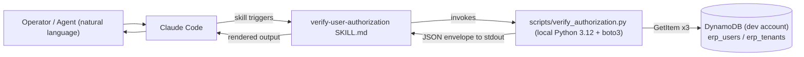

# ERP VerifyUserAuthorization — Hackathon POC Plan

## 1. Context

LINQ ERP v4 has a C# endpoint, `HarmonyAuthAuthorize`, that decides whether a `(user_email, tenant_id)` pair can sign in to ERP. It does this by reading two DynamoDB rows from `erp_users` and one row from `erp_tenants`. During incidents, operators (and our hackathon agent) need to *verify the same decision out-of-band* without trusting the same code path that may itself be misbehaving.

This skill, **`verify-user-authorization`**, ports the decision logic to a local Python helper that boto3-reads the same DynamoDB rows directly, and ships it as a Claude Code plugin via a marketplace at `github.com/shannoncarver/hackathon-may-2026` (existing repo). The deliverable is dev-only, throwaway-creds, and built for hackathon demo speed — production-shaped concerns (Lambda, IAM-role auth, audit, redaction) are deferred.

The skill's primary consumer is the broader Harmony Authorize Incident Agent described in `hackathon-1/docs/`. It supplies raw evidence (Layer 3 / Layer 5 in `failure-taxonomy.md`) for the Provisioning Reconciler subagent's truth table.

**Resolved decisions** (from user review of v1 plan):
- Names locked: marketplace `linq-erp-skills`, plugin `erp-authz`, skill `verify-user-authorization`.
- Tables locked: `dev_erp_users` / `dev_erp_tenants`. Convention is `{env}_erp_users` / `{env}_erp_tenants` (prod is unprefixed `erp_users` / `erp_tenants`).
- Repo locked: push to existing `github.com/shannoncarver/hackathon-may-2026`.
- Unauthorized envelopes: null both `user` and `tenant` (do not leak partial records).
- Superuser path included.
- `matched_user_record` field kept.
- Tenant Mapping MCP server is unrelated — no coexistence concern.

---

## 2. Current state (C# decision logic — verified against source)

**Source:** `LINQ-ERP-v4/src/Api/Features/Auth/HarmonyAuthAuthorize.cs:130–225` (handler), `:281–338` (`QueryUserAsync`), `:340–403` (`QueryTenantAsync`).

**Three GetItems run in parallel via `Task.WhenAll`:**

| # | Table env var (default) | PK | SK | Purpose |
|---|---|---|---|---|
| 1 | `ERP_USERS_TABLE_NAME` (default `erp_users`) | `#USRID#{email_lc}` | `#TEN#{tenantId_lc}` | User-in-tenant row |
| 2 | `ERP_USERS_TABLE_NAME` (default `erp_users`) | `#USRID#{email_lc}` | `#TEN#superuser` | Superuser row |
| 3 | `ERP_TENANTS_TABLE_NAME` (default `erp_tenants`) | `#TEN#{tenantId_lc}` | `#TEN#` | Tenant row |

`QueryUserAsync` / `QueryTenantAsync` return `null` on either "row not found" or exception. Otherwise they return a tuple whose first field is always `true`.

**Decision tree, exactly as the C# runs:**

```
if superuser row exists:
    if status == "active" (case-insensitive):
        isAuthorized = true; isSuperUser = true
    else:
        isAuthorized stays false (user-in-tenant is NEVER consulted)
elif user-in-tenant row exists:
    if status == "active":
        isAuthorized = true
    else:
        isAuthorized stays false
else:
    isAuthorized stays false

# Tenant override (separate block):
if tenant row exists:
    if status == "active":
        capture db_id, connection_string_id
    else:
        isAuthorized = false   # OVERRIDE
# if tenant row does NOT exist: no override (auth retains user-side value)
```

**Two C# behaviors that look like bugs but are part of the contract for this POC** (see clarifying questions):

- **B1.** A superuser row that exists but is *not active* hides any active user-in-tenant row.
- **B2.** A *missing* tenant row does **not** invalidate authorization. Only an *inactive* tenant overrides.

**Attributes the C# touches:**

| Table | Attribute | Used for |
|---|---|---|
| users | `status` | decision |
| users | `db_user_id` | claim (`erpDbUserId`) |
| tenants | `status` | decision (active gates auth) |
| tenants | `db_id` | claim (`erpDbId`) |
| tenants | `connection_string_id` | claim (`erpDbConnStrId`) |

**Environment-specific behavior:** none beyond the env-var-driven table names. Region comes from the AWS SDK config.

---

## 3. POC architecture

### POC (now)



Creds: static `AWS_ACCESS_KEY_ID` / `AWS_SECRET_ACCESS_KEY` env vars (or any other boto3-default-chain source) belonging to a throwaway IAM user with `dynamodb:GetItem` on the two tables.

### Production target (post-hackathon, illustrative only)

```mermaid
flowchart LR
  agent["Claude Code"] --> skill["verify-user-authorization skill"]
  skill -->|HTTPS + JWT (mcp:diagnose scope)| apigw["API Gateway"]
  apigw --> lambda["Lambda (Python)"]
  lambda -->|IAM role: GetItem only| ddb[("DynamoDB\nprod_erp_users / prod_erp_tenants")]
  lambda --> cw["CloudWatch (audit log)"]
```

---

## 4. Recommended naming

| Slot | Recommendation | Rationale |
|---|---|---|
| Marketplace | `linq-erp-skills` | Long-lived bucket of LINQ-ERP skills, decoupled from the hackathon repo name. |
| Plugin | `erp-authz` | Short, kebab-case, no redundancy with marketplace. |
| Skill | `verify-user-authorization` | Matches Anthropic skill examples; description carries the trigger phrases so the directory name doesn't have to. |

Trims: dropped `linq-` from plugin (marketplace already says it), `erp-` from skill (plugin namespace already says it), `harmony-auth-` from skill (the Harmony endpoint is one *consumer* of this logic, not the skill's identity). "Harmony auth lookup" lives in the SKILL.md `description` for discoverability.

---

## 5. Repo directory tree (after the skill is added)

```
hackathon-may-2026/                           ← local checkout = hackathon-1
├── .claude-plugin/
│   └── marketplace.json                      ← NEW
├── .claude/                                  (existing)
├── .github/                                  (existing)
├── .gitignore                                (existing)
├── CLAUDE.md                                 (existing)
├── Makefile                                  (existing)
├── README.md                                 (existing — add install instructions)
├── dashboard/                                (existing)
├── docs/                                     (existing planning docs)
│   ├── architecture.md
│   ├── erp-v4-mcp.md
│   ├── failure-taxonomy.md
│   ├── mcp-auth-decision.md
│   ├── plan.md
│   ├── plans/
│   │   └── erp-verify-user-authorization-poc-plan.md   ← NEW (this file)
│   ├── planning-conversation.md
│   └── skills-spec.md
├── plugins/
│   └── erp-authz/                            ← NEW
│       ├── .claude-plugin/
│       │   └── plugin.json                   ← NEW
│       └── skills/
│           └── verify-user-authorization/
│               ├── SKILL.md                  ← NEW
│               └── scripts/
│                   └── verify_authorization.py   ← NEW
└── project/                                  (existing)
```

---

## 6. DRAFT `.claude-plugin/marketplace.json`

```json
{
  "$schema": "https://json.schemastore.org/claude-code-marketplace.json",
  "name": "linq-erp-skills",
  "description": "LINQ ERP v4 operator and diagnostic skills for Claude Code.",
  "owner": {
    "name": "Shannon Carver",
    "email": "mshannoncarver@gmail.com",
    "url": "https://github.com/shannoncarver"
  },
  "plugins": [
    {
      "name": "erp-authz",
      "description": "Verify whether a user is authorized for a LINQ ERP tenant by reading erp_users and erp_tenants from DynamoDB. Mirrors the HarmonyAuthAuthorize C# decision logic.",
      "version": "0.1.0",
      "source": {
        "source": "git-subdir",
        "url": "https://github.com/shannoncarver/hackathon-may-2026.git",
        "path": "plugins/erp-authz",
        "ref": "main"
      },
      "keywords": ["linq", "erp", "authorization", "harmony-auth", "dynamodb", "diagnostics"],
      "category": "diagnostics"
    }
  ]
}
```

`ref: "main"` is mutable; switch to a tag (`v0.1.0`) once the demo build is locked.

---

## 7. DRAFT `plugins/erp-authz/.claude-plugin/plugin.json`

Recommended: include this file. The marketplace runs without it, but it earns its keep here for (a) per-plugin version pinning, (b) authorship/keywords visible in `/plugin info`, (c) standalone documentation when someone `cd`s into the plugin without context.

```json
{
  "$schema": "https://json.schemastore.org/claude-code-plugin.json",
  "name": "erp-authz",
  "version": "0.1.0",
  "description": "Verify ERP user authorization by reading erp_users and erp_tenants in DynamoDB. Ports the HarmonyAuthAuthorize C# endpoint into a local Python helper for incident-triage evidence.",
  "author": {
    "name": "Shannon Carver",
    "email": "mshannoncarver@gmail.com"
  },
  "homepage": "https://github.com/shannoncarver/hackathon-may-2026",
  "repository": "https://github.com/shannoncarver/hackathon-may-2026",
  "license": "UNLICENSED",
  "keywords": ["linq", "erp", "authorization", "harmony-auth", "dynamodb", "diagnostics"]
}
```

---

## 8. DRAFT `plugins/erp-authz/skills/verify-user-authorization/SKILL.md`

```markdown
---
name: verify-user-authorization
description: Verify whether a user is authorized for a LINQ ERP tenant. Use when the user asks "is this user authorized for tenant X", "verify user authorization", "check ERP access for user", "ERP authz check", "harmony auth lookup", "why can't <email> log in to ERP", "can <email> sign in for tenant <id>", or wants the raw erp_users / erp_tenants records as evidence. Reads DynamoDB directly via boto3 and mirrors the HarmonyAuthAuthorize C# endpoint's decision logic. Returns a JSON envelope with authorized=true|false, a status enum (AUTHORIZED_SUPERUSER, AUTHORIZED_USER, USER_NOT_FOUND, USER_DISABLED, SUPERUSER_DISABLED, TENANT_DISABLED, TENANT_MISSING_BUT_USER_AUTHORIZED, TENANT_MISSING_USER_NOT_AUTHORIZED, ERROR), the matched user-record kind, and the raw user and tenant attributes. Dev environment only.
allowed-tools: Bash
argument-hint: <tenant_id> <user_email>
---

# verify-user-authorization

Reproduces the LINQ ERP `HarmonyAuthAuthorize` C# endpoint's decision logic locally. Use when an operator asks whether a user can sign in to ERP for a given tenant, or when an incident-triage agent needs raw evidence from `erp_users` and `erp_tenants`.

**Decision semantics mirror the C# exactly**, including two surprising-but-real behaviors:

- A superuser row that exists but is *not active* prevents the user-in-tenant row from being consulted.
- A *missing* tenant row does NOT invalidate authorization (only an *inactive* tenant does).

If you need the corrected/intuitive logic instead, ask the user before deviating.

## When to use

- "Is `alice@example.com` authorized for tenant `acme-isd`?"
- "Verify ERP access for `bob@example.com` in `springfield-school-district`."
- "Run the harmony auth check against `<email>` and `<tenant>`."
- "Why is this user getting a 401 from the product after Auth0 login?"
- An incident agent needs the raw user / tenant DynamoDB records as evidence.

## When NOT to use

- Production lookups. This skill is gated to `--environment dev`.
- Anything that mutates ERP state (read-only).

## Inputs

| Argument | Required | Notes |
|---|---|---|
| `tenant_id` | yes | Lowercased internally before key construction. |
| `user_email` | yes | Must be a valid email; lowercased internally. |
| `environment` | yes | Only `dev` is accepted in the POC. |

## Output envelope (stdout, JSON)

```json
{
  "authorization": {
    "authorized": true,
    "status": "AUTHORIZED_USER",
    "reason": null
  },
  "user": { "PK": "...", "SK": "...", "status": "active", "db_user_id": "...", "...": "..." },
  "tenant": { "PK": "...", "SK": "...", "status": "active", "db_id": "...", "connection_string_id": "...", "...": "..." },
  "matched_user_record": "in_tenant"
}
```

`status` enum:

| Status | Meaning |
|---|---|
| `AUTHORIZED_SUPERUSER` | Active superuser row + active tenant. |
| `AUTHORIZED_USER` | No superuser row, active user-in-tenant row, active tenant. |
| `SUPERUSER_DISABLED` | Superuser row exists but inactive (user-in-tenant not consulted, per C#). |
| `USER_DISABLED` | No superuser row, user-in-tenant exists but inactive. |
| `USER_NOT_FOUND` | Neither user row exists. Tenant active or absent. |
| `TENANT_DISABLED` | Tenant exists but inactive. Overrides any user-side authorization. |
| `TENANT_MISSING_BUT_USER_AUTHORIZED` | Tenant row absent **but** user/superuser is active → authorized per C#. Surface this loudly. |
| `TENANT_MISSING_USER_NOT_AUTHORIZED` | Tenant row absent and user-side decision is also unauthorized. |
| `ERROR` | AWS credential / network / input error. See `reason`. |

`matched_user_record`: `"in_tenant"`, `"superuser"`, or `null`. When `superuser` matched, the `user` field carries the superuser row.

## How to invoke

```bash
python3 "${CLAUDE_SKILL_DIR}/scripts/verify_authorization.py" \
  --tenant-id "<tenant>" \
  --user-email "<email>" \
  --environment dev
```

The script always exits 0; the JSON envelope on stdout is the only contract. Diagnostic messages go to stderr.

## Required environment

| Variable | Default | Notes |
|---|---|---|
| `AWS_REGION` | `us-east-1` | Matches `LINQ-ERP-v4/appsettings.json`. |
| `ERP_USERS_TABLE_NAME` | `dev_erp_users` | Convention `{env}_erp_users`; prod is unprefixed `erp_users`. |
| `ERP_TENANTS_TABLE_NAME` | `dev_erp_tenants` | Convention `{env}_erp_tenants`; prod is unprefixed `erp_tenants`. |
| AWS credentials | — | boto3 default chain — see "AWS auth" below. |

## AWS auth — most seamless flow for AWS-console SSO users

If you sign in to the AWS console via SSO / Identity Center, you already have everything boto3 needs. Two patterns, easiest first:

### Pattern A — paste-from-console (zero setup, ~30s per session)

1. Open the AWS access portal (the SSO start page).
2. Click your dev account → role → **"Command line or programmatic access"**.
3. Copy the **"Option 1: Set AWS environment variables"** block. It looks like:
   ```bash
   export AWS_ACCESS_KEY_ID="ASIA..."
   export AWS_SECRET_ACCESS_KEY="..."
   export AWS_SESSION_TOKEN="..."
   ```
4. Paste into the same terminal where Claude Code is running. boto3's default credential chain picks them up automatically. Tokens typically last 1–12 hours.

This is the recommended hackathon path — no AWS CLI configuration, no profile management, just three env vars from a button click.

### Pattern B — `aws sso login` (one-time setup, refresh on demand)

```bash
# One-time:
aws configure sso
# Daily / when expired:
aws sso login --profile <profile-name>
export AWS_PROFILE=<profile-name>
```

boto3 reads `~/.aws/sso/cache/` automatically. Use this if you'll be running the skill many times across days.

Both patterns work with this skill unchanged — boto3's default credential chain order is: env vars (Pattern A) → `AWS_PROFILE` (Pattern B) → instance role. No code changes required.

## Least-privilege IAM policy

```json
{
  "Version": "2012-10-17",
  "Statement": [
    {
      "Sid": "ErpAuthzReadOnly",
      "Effect": "Allow",
      "Action": "dynamodb:GetItem",
      "Resource": [
        "arn:aws:dynamodb:us-east-1:*:table/dev_erp_users",
        "arn:aws:dynamodb:us-east-1:*:table/dev_erp_tenants"
      ]
    }
  ]
}
```

## Examples

### Authorized

```json
{
  "authorization": {"authorized": true, "status": "AUTHORIZED_USER", "reason": null},
  "user": {"PK": "#USRID#alice@example.com", "SK": "#TEN#acme-isd", "status": "active", "db_user_id": "u-123"},
  "tenant": {"PK": "#TEN#acme-isd", "SK": "#TEN#", "status": "active", "db_id": "t-789", "connection_string_id": "cs-555"},
  "matched_user_record": "in_tenant"
}
```

### Unauthorized — tenant disabled

`user` and `tenant` are nulled on any unauthorized outcome to avoid leaking partial records. Diagnostic detail lives in `reason` and `matched_user_record`.

```json
{
  "authorization": {
    "authorized": false,
    "status": "TENANT_DISABLED",
    "reason": "Tenant exists but status is 'inactive'."
  },
  "user": null,
  "tenant": null,
  "matched_user_record": "in_tenant"
}
```

## Notes for the agent

- The full user/tenant records are returned. Treat `db_id`, `db_user_id`, `connection_string_id` as sensitive; do not paste verbatim into a public chat.
- C# does the three GetItems in parallel; the Python helper does them sequentially for readability — irrelevant at three calls.
```

`description` length: ~1,150 chars (under 1,536 budget).

---

## 9. DRAFT `plugins/erp-authz/skills/verify-user-authorization/scripts/verify_authorization.py`

```python
#!/usr/bin/env python3
"""verify_authorization.py

Local Python port of LINQ-ERP-v4's HarmonyAuthAuthorize C# endpoint.

Reads erp_users (twice) and erp_tenants (once) from DynamoDB and emits a JSON
envelope describing whether the (user, tenant) pair is authorized.

DECISION SEMANTICS: mirrors the C# exactly, including two surprising behaviors
that look like bugs but are part of the spec for this POC:

  B1. A superuser row that exists but is NOT 'active' prevents the user-in-tenant
      row from ever being consulted.
  B2. A MISSING tenant row does NOT override authorization. Only an INACTIVE
      tenant row triggers the override.

If/when the user asks for the "fixed" semantics, swap the decision block.

Always exits 0. AWS / network / input errors are surfaced inside the envelope as
status == "ERROR" so the calling agent can parse stdout unconditionally.
"""

from __future__ import annotations

import argparse
import json
import os
import re
import sys
from decimal import Decimal
from typing import Any

try:
    import boto3
    from botocore.exceptions import BotoCoreError, ClientError, NoCredentialsError
except ImportError as exc:  # pragma: no cover
    print(
        json.dumps(
            {
                "authorization": {
                    "authorized": False,
                    "status": "ERROR",
                    "reason": f"boto3 is required but not installed: {exc}",
                },
                "user": None,
                "tenant": None,
                "matched_user_record": None,
            }
        )
    )
    sys.exit(0)


EMAIL_RE = re.compile(r"^[^@\s]+@[^@\s]+\.[^@\s]+$")


def _decimal_default(o: Any) -> Any:
    if isinstance(o, Decimal):
        return int(o) if o == o.to_integral_value() else float(o)
    if isinstance(o, set):
        return sorted(o)
    if isinstance(o, bytes):
        return o.decode("utf-8", errors="replace")
    raise TypeError(f"Object of type {o.__class__.__name__} is not JSON serializable")


def _envelope(authorized, status, reason, user, tenant, matched):
    return {
        "authorization": {"authorized": authorized, "status": status, "reason": reason},
        "user": user,
        "tenant": tenant,
        "matched_user_record": matched,
    }


def _emit(env):
    # Null user/tenant on any unauthorized outcome — diagnostic detail lives in
    # `reason` and `matched_user_record`. Avoids leaking partial records.
    if env["authorization"]["authorized"] is False:
        env = {**env, "user": None, "tenant": None}
    print(json.dumps(env, default=_decimal_default))


def _is_active(record):
    if not record:
        return False
    status = record.get("status")
    return isinstance(status, str) and status.strip().lower() == "active"


def _get_item(table, key, label):
    response = table.get_item(Key=key, ConsistentRead=False)
    item = response.get("Item")
    if item is None:
        print(f"[verify_authorization] {label}: no item for {key}", file=sys.stderr)
        return None
    print(f"[verify_authorization] {label}: hit", file=sys.stderr)
    return item


def main() -> int:
    parser = argparse.ArgumentParser(description="Verify ERP user authorization (dev only).")
    parser.add_argument("--tenant-id", required=True)
    parser.add_argument("--user-email", required=True)
    parser.add_argument("--environment", required=True, choices=["dev"])
    args = parser.parse_args()

    user_email = args.user_email.strip().lower()
    tenant_id = args.tenant_id.strip().lower()

    if not EMAIL_RE.match(user_email):
        _emit(_envelope(False, "ERROR", f"Invalid email: {args.user_email!r}", None, None, None))
        return 0

    region = os.environ.get("AWS_REGION", "us-east-1")
    users_table_name = os.environ.get("ERP_USERS_TABLE_NAME", "dev_erp_users")
    tenants_table_name = os.environ.get("ERP_TENANTS_TABLE_NAME", "dev_erp_tenants")

    print(
        f"[verify_authorization] region={region} users={users_table_name} "
        f"tenants={tenants_table_name} email={user_email} tenant={tenant_id}",
        file=sys.stderr,
    )

    try:
        ddb = boto3.resource("dynamodb", region_name=region)
        users_table = ddb.Table(users_table_name)
        tenants_table = ddb.Table(tenants_table_name)

        # Three sequential GetItems. C# uses Task.WhenAll for parallel execution;
        # at three calls of ~5–20ms each, sequential is well under any latency
        # budget. To parallelize: ThreadPoolExecutor with 3 separate Table
        # instances (boto3 clients are not thread-safe).
        user_in_tenant = _get_item(
            users_table,
            {"PK": f"#USRID#{user_email}", "SK": f"#TEN#{tenant_id}"},
            label="user_in_tenant",
        )
        superuser = _get_item(
            users_table,
            {"PK": f"#USRID#{user_email}", "SK": "#TEN#superuser"},
            label="superuser",
        )
        tenant = _get_item(
            tenants_table,
            {"PK": f"#TEN#{tenant_id}", "SK": "#TEN#"},
            label="tenant",
        )
    except NoCredentialsError as exc:
        _emit(_envelope(False, "ERROR", f"AWS credentials not found: {exc}", None, None, None))
        return 0
    except (ClientError, BotoCoreError) as exc:
        _emit(_envelope(False, "ERROR", f"DynamoDB error: {exc}", None, None, None))
        return 0

    # ---- Decision logic — mirrors C# exactly --------------------------------
    # User-side decision (lines 157–193 of HarmonyAuthAuthorize.cs):
    #   if superuser row exists:
    #       authorized iff status == "active"   (B1: user-in-tenant NOT consulted)
    #   elif user-in-tenant row exists:
    #       authorized iff status == "active"
    #   else:
    #       not authorized
    if superuser is not None:
        matched = "superuser"
        user_record = superuser
        if _is_active(superuser):
            user_authorized = True
            user_status_kind = "AUTHORIZED_SUPERUSER"
        else:
            user_authorized = False
            user_status_kind = "SUPERUSER_DISABLED"
    elif user_in_tenant is not None:
        matched = "in_tenant"
        user_record = user_in_tenant
        if _is_active(user_in_tenant):
            user_authorized = True
            user_status_kind = "AUTHORIZED_USER"
        else:
            user_authorized = False
            user_status_kind = "USER_DISABLED"
    else:
        matched = None
        user_record = None
        user_authorized = False
        user_status_kind = "USER_NOT_FOUND"

    # Tenant-side override (lines 197–219):
    #   if tenant row exists and active: capture db_id, conn_str_id (no auth change)
    #   elif tenant row exists and inactive: isAuthorized = false (override)
    #   else (tenant row missing): no override (B2)
    if tenant is None:
        # B2: tenant missing does not invalidate user-side decision.
        if user_authorized:
            _emit(_envelope(
                True,
                "TENANT_MISSING_BUT_USER_AUTHORIZED",
                "Tenant row absent; C# logic still authorizes when user/superuser is active.",
                user_record,
                None,
                matched,
            ))
        else:
            _emit(_envelope(
                False,
                "TENANT_MISSING_USER_NOT_AUTHORIZED",
                f"Tenant row absent and user-side outcome is {user_status_kind}.",
                user_record,
                None,
                matched,
            ))
        return 0

    if not _is_active(tenant):
        _emit(_envelope(
            False,
            "TENANT_DISABLED",
            f"Tenant exists but status is {tenant.get('status')!r}.",
            user_record,
            tenant,
            matched,
        ))
        return 0

    # Tenant is active — surface the user-side outcome.
    if user_authorized:
        _emit(_envelope(True, user_status_kind, None, user_record, tenant, matched))
        return 0

    reason_map = {
        "USER_NOT_FOUND": (
            f"No user row at PK=#USRID#{user_email} for SK=#TEN#{tenant_id} or SK=#TEN#superuser."
        ),
        "USER_DISABLED": f"User row found but status is {(user_in_tenant or {}).get('status')!r}.",
        "SUPERUSER_DISABLED": (
            f"Superuser row found but status is {(superuser or {}).get('status')!r}; "
            "C# does not consult the user-in-tenant row when a superuser row exists."
        ),
    }
    _emit(_envelope(
        False,
        user_status_kind,
        reason_map.get(user_status_kind, "Unauthorized."),
        user_record,
        tenant,
        matched,
    ))
    return 0


if __name__ == "__main__":
    sys.exit(main())
```

Key differences from a "naive" port:
- Mirrors the C# `if/elif` structure exactly so B1 (superuser row hides user-in-tenant) and B2 (missing tenant doesn't override) are preserved.
- Surfaces those quirks as distinct status enum values (`SUPERUSER_DISABLED`, `TENANT_MISSING_*`) so the agent can flag them rather than silently treating them as ordinary auth failures.

---

## 10. Attribute catalog

Best-effort, derived from C# reads + repo grep. The skill returns ALL attributes verbatim, so this catalog is for documentation, not runtime filtering.

### `dev_erp_users`

| Attribute | Type (inferred) | Semantic | Used by C#? | Sensitivity |
|---|---|---|---|---|
| `PK` | String | `#USRID#{email_lc}` | key | low |
| `SK` | String | `#TEN#{tenantId_lc}` or `#TEN#superuser` | key | low |
| `status` | String | `"active"` / inactive variants | **decision** | low |
| `db_user_id` | String | foreign key to product DB user row | claim | **medium** (PII-adjacent) |
| `user_email` | String | denormalized email | — | **high** (PII) |
| `created_at` / `updated_at` | String/Number | timestamps | — | low |

### `dev_erp_tenants`

| Attribute | Type (inferred) | Semantic | Used by C#? | Sensitivity |
|---|---|---|---|---|
| `PK` | String | `#TEN#{tenantId_lc}` | key | low |
| `SK` | String | literal `#TEN#` | key | low |
| `status` | String | `"active"` / inactive variants | **decision** | low |
| `db_id` | String | foreign key to product DB tenant row | claim | **medium** |
| `connection_string_id` | String | secret-manager handle to DB conn string | claim | **HIGH** (secret pointer) |
| `tenant_name` | String | display name | — | low |
| `features`, `settings`, `metadata` | Map | per-tenant config | — | varies |

Sensitive attributes confirmed in `LINQ-ERP-v4/v4-app/ecs/ecs-dynamodb-policy.json` and the C# claim assembly. `connection_string_id` should be redacted in any operator-facing rendering during the demo (not technically a secret, but it's a pointer to one).

---

## 11. Phased implementation plan

### Phase A — script standalone (60–90 min)

1. Scratch venv outside the plugin tree; `pip install boto3`.
2. Drop `verify_authorization.py` in.
3. Export `AWS_PROFILE`, `ERP_USERS_TABLE_NAME`, `ERP_TENANTS_TABLE_NAME`.
4. Run against known authorized + disabled + missing pairs.

**Acceptance:**
- Authorized user case → `authorization.authorized == true`, both records populated.
- Each unauthorized branch → correct `status` enum.
- Bogus AWS creds → `status: "ERROR"`, exit 0, valid JSON.
- All status enums reachable on real dev data (or seeded fixtures).

### Phase B — skill scaffold for fast iteration (30–45 min)

1. Symlink/copy `SKILL.md` + `scripts/` into `~/.claude/skills/verify-user-authorization/` (skips trust flow).
2. Restart Claude Code; ask "Verify ERP authorization for `<email>` in tenant `<id>` — dev."
3. Iterate `description` trigger phrases.

**Acceptance:**
- Skill triggers on ≥ 4 of 5 sample phrasings.
- Claude calls the script via `${CLAUDE_SKILL_DIR}/scripts/verify_authorization.py` and renders the parsed JSON.
- stderr diagnostics visible but not bleeding into stdout.

### Phase C — marketplace packaging (45–60 min)

1. Move SKILL.md + script into `plugins/erp-authz/skills/verify-user-authorization/`.
2. Add `plugins/erp-authz/.claude-plugin/plugin.json`.
3. Add `.claude-plugin/marketplace.json` at repo root.
4. Add `git remote add origin git@github.com:shannoncarver/hackathon-may-2026.git` (or the HTTPS equivalent) to the local `hackathon-1` checkout, since the existing GitHub repo is `shannoncarver/hackathon-may-2026`.
5. `git push -u origin main`.

**Acceptance:**
- Both manifest files parse as JSON.
- `git ls-tree -r HEAD plugins/erp-authz` shows exactly: `.claude-plugin/plugin.json`, `skills/verify-user-authorization/SKILL.md`, `skills/verify-user-authorization/scripts/verify_authorization.py`.

### Phase D — end-to-end install test (30–45 min)

On a clean Claude Code session (or after `~/.claude/plugins/cache/` cleared):

1. `/plugin marketplace add shannoncarver/hackathon-may-2026`
2. `/plugin install erp-authz@linq-erp-skills`
3. Approve trust dialog.
4. `/reload-plugins`
5. Set env vars + AWS_PROFILE.
6. Verify authorized + each unauthorized branch via natural language.

**Acceptance:**
- Marketplace adds without error.
- Plugin installs from `git-subdir` source.
- All status enums reachable end-to-end via natural-language requests.

---

## 12. Future productionization

- Lambda + API Gateway behind same VPC/IAM as the C# endpoint; skill becomes a thin caller.
- Terraform module for IAM role / Lambda / API Gateway / log group.
- Auth on the helper itself: Auth0 JWT with `erp:authz:read` scope (matches `mcp-auth-decision.md`).
- Lambda IAM role grants `dynamodb:GetItem`; remove static creds path.
- CloudWatch audit log per invocation: `actor`, `target_email_hash` (SHA-256 the email — never log raw), `target_tenant`, `outcome`.
- Default redaction: prod skill returns only `authorized` + `status` + `reason`; full record requires `--include-record` + elevated scope.
- 30s in-memory TTL cache during a single agent session (off during live demos).
- **Private-repo auth flow when `hackathon-may-2026` goes private** — pick one:
  - **SSH** (recommended for developer flow): `source.url` becomes `git@github.com:shannoncarver/hackathon-may-2026.git`; user needs SSH key.
  - **gh CLI** fallback: rely on `gh auth login`.
  - **PAT** (last resort): `https://<token>@github.com/...` URL form. Credential-rotation hazard.
- Version-pinning: marketplace `ref` moves from `main` → tag `erp-authz-v0.2.0`; semver-bump on every change. Operators opt into `main` for canary.
- Fix B1 (inactive-superuser hides user-in-tenant) and B2 (missing-tenant doesn't override) in the C# endpoint, then update this skill to match.

---

## 13. Risks & open questions

- **Sensitive-attribute leakage** from "return all attributes raw": `db_id`, `db_user_id`, `connection_string_id`, plus any future-added field. Mitigation in §12; for POC, documented in SKILL.md.
- **Credential rotation post-demo.** If the demo machine has long-lived `AWS_ACCESS_KEY_ID` env vars set, rotate them after the hackathon. Prefer SSO so creds are short-lived by construction.
- **Trust-dialog UX on first install.** User approves once per machine and again after `/plugin update`. Add a screenshot to the README for first-time installers.
- **C# vs Python parallel-fetch performance.** Three sequential GetItems at ~5–20ms each = ~30–60ms total. Below any latency the agent or human will notice; revisit only if hammered in a fleet-health flow.
- **B1 (superuser hides user-in-tenant) and B2 (missing tenant doesn't override).** Surfaced as distinct status enum values so the agent can flag them. Could be the *intent* of the C# (e.g. "if your account exists as a superuser at all, that's the only path you use") rather than bugs — confirm before fixing.

---

## 14. Clarifying questions — all resolved

- ✅ Names: `linq-erp-skills` / `erp-authz` / `verify-user-authorization`.
- ✅ Tables: `dev_erp_users` / `dev_erp_tenants`. Convention `{env}_erp_*`; prod is unprefixed.
- ✅ Partial records on unauthorized: null both `user` and `tenant`. Reflected in script + SKILL.md.
- ✅ Tenant Mapping MCP: unrelated; no coexistence concern.
- ✅ Missing referenced files (OpenAPI spec, SSO PNG): proceed without.
- ✅ Superuser path: include.
- ✅ Repo destination: existing `shannoncarver/hackathon-may-2026`.
- ✅ `matched_user_record` field: keep.
- ✅ AWS auth flow: documented in §8 — paste-from-Access-Portal env vars (Pattern A) is the recommended hackathon path; `aws sso login` (Pattern B) for repeated use.
- ✅ **C# semantic preservation:** Mirror C# exactly. B1 / B2 surfaced as distinct status enum values (`SUPERUSER_DISABLED`, `TENANT_MISSING_BUT_USER_AUTHORIZED`, `TENANT_MISSING_USER_NOT_AUTHORIZED`) so the agent flags them rather than silently masking.
- ✅ **Sensitive attributes:** Redact `*_id` attributes by default in the authorized envelope (literal value `"<redacted>"`, key preserved). `--include-sensitive` opts out. Reflected in script + SKILL.md.
- ✅ **Demo data:** Not needed.
- ✅ **Versioning:** Keep `version: "0.1.0"` in `plugin.json` for identity; keep `ref: "main"` in `marketplace.json` so installers auto-pull every commit. Bump `0.1.0 → 0.2.0` only on **breaking envelope changes** during the hackathon. When productionizing, swap `ref: "main"` for an immutable tag (e.g. `v0.2.0`) and start strict semver-bump-per-change.

---

## 15. Critical files for implementation

- `hackathon-1/plugins/erp-authz/skills/verify-user-authorization/scripts/verify_authorization.py` (NEW)
- `hackathon-1/plugins/erp-authz/skills/verify-user-authorization/SKILL.md` (NEW)
- `hackathon-1/.claude-plugin/marketplace.json` (NEW)
- `hackathon-1/plugins/erp-authz/.claude-plugin/plugin.json` (NEW)
- `hackathon-1/docs/plans/erp-verify-user-authorization-poc-plan.md` (NEW — the deliverable)
- `LINQ-ERP-v4/src/Api/Features/Auth/HarmonyAuthAuthorize.cs:130–225, 281–403` (read-only reference)

---

## 16. Verification

- Phase A: invoke the script directly with each known-state (user, tenant) pair; assert each status enum.
- Phase B: ask Claude Code 5 different phrasings of "verify ERP auth"; ≥ 4 should trigger.
- Phase C: `python -c "import json; json.load(open('.claude-plugin/marketplace.json'))"` and same for `plugin.json`. Push and `gh repo view` the rendered tree.
- Phase D: clean-machine install via `/plugin marketplace add` + `/plugin install`, exercise all enums by natural-language prompt.

---

## Appendix: clarifying questions

All resolved — see §14.
