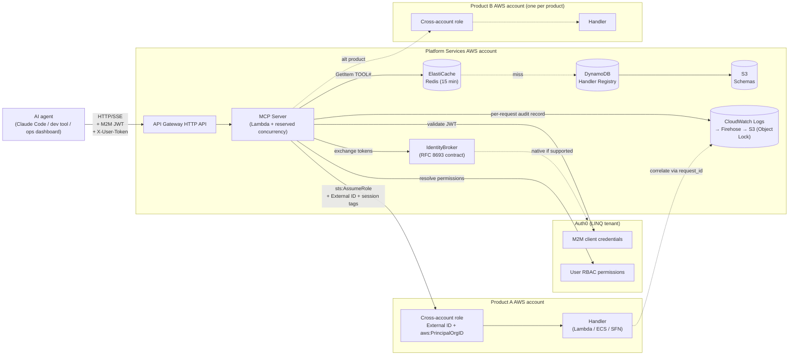
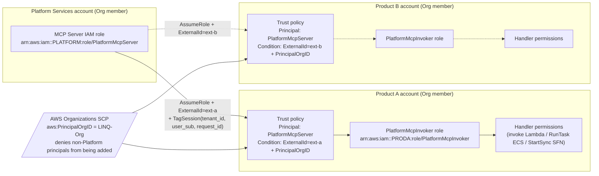
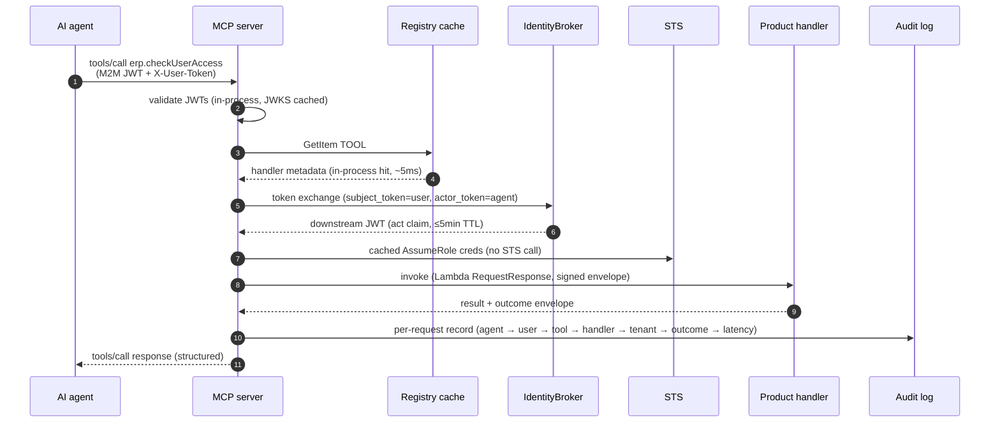
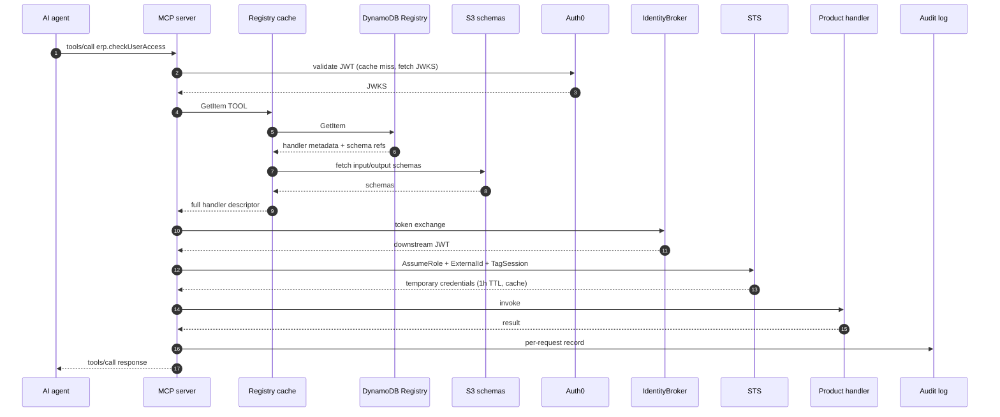
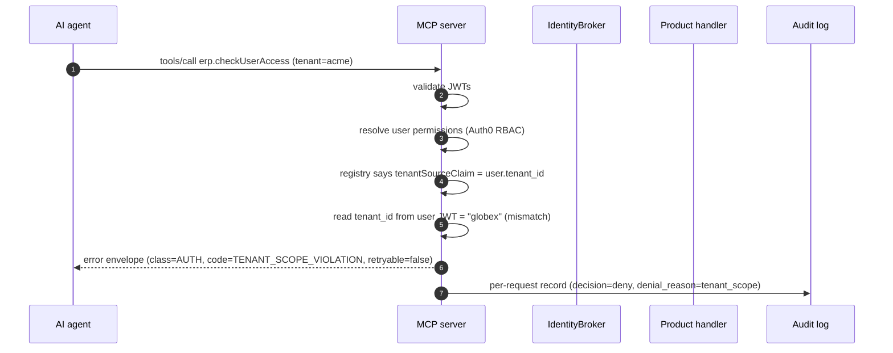

# Architecture — components, trust diagrams, reference flows

## Component view

## Cross-account trust diagram

**Key elements.**
- One `PlatformMcpServer` IAM role in Platform Services. Trusts no external principal.
- One `PlatformMcpInvoker` role per product account, scoped to that product's handlers.
- Per-product External ID (32-char identifier, registered at onboarding, stored in the registry's product table). Identifier, not credential. Failure mode it protects: Confused Deputy across products under registry tampering or future product spinout.
- `aws:PrincipalOrgID` SCP layered on top — additional defense, prevents non-Org principals from ever being added to a trust policy. Not a substitute for External ID.
- `sts:TagSession` on every AssumeRole carries `tenant_id`, `user_sub`, `agent_client_id`, `request_id`. Tags are attribute-bound — handler IAM policies may reference `aws:PrincipalTag/tenant_id` for an in-IAM tenant guardrail layered under handler-level row checks.

## Reference flow 1 — warm path (cache hits)

Expected latency budget on the warm path: `~200ms P50` end-to-end. STS AssumeRole is not on the path (cached). Registry GetItem is in-process map. Handler P50 is `~100ms`.

## Reference flow 2 — cold path (all caches miss)

Expected latency budget on the cold path: `~1500ms P95` end-to-end. STS AssumeRole adds 100–300ms. Registry + S3 schema fetch adds another 50–100ms. JWKS fetch adds 50–100ms. Subsequent calls within the cache windows hit the warm path.

## Reference flow 3 — error: tenant-scope violation

The MCP server **never** trusts the agent-supplied tenant argument. Tenant is read from the user's verified JWT and injected as a separate, signed handler argument. Mismatch fails before any STS call.

## On-call boundary matrix

| Failure stage | Symptom | Owner | Escalation if not resolved |
|---|---|---|---|
| MCP-server JWT validation | 401 from MCP | Platform | Identity team if Auth0 config issue |
| Registry GetItem | `tools/list` empty or `tools/call` returns NOT_FOUND | Platform | Stop the bus — registry is V1 hot path |
| IdentityBroker / token exchange | 502 with `class=AUTH` | Platform | Identity team if Auth0 RFC 8693 changes |
| STS AssumeRole | 502 with `class=AUTH`, AccessDenied trace | Platform until product IAM trust policy is proven mis-set, then product | Joint debug; trust-policy ownership lives with product |
| Handler invoke (Lambda 5xx) | 502 with `class=UPSTREAM_ERROR` | Owning product team | Stop incidents at handler boundary |
| Handler timeout | 504 with `class=UPSTREAM_TIMEOUT` | Owning product team | Negotiate `timeoutMs` increase via registry update |
| Audit log shipping lag | Audit-delivery alarm | Platform | CloudOps if cross-account log shipping breaks |
| Auth0 outage | Cascading auth failures | Identity team | Platform bypasses with cached tokens within 23h |
| Agent-side timeout | Agent reports MCP timeout | Agent owner first; escalate to Platform if MCP server is responsive | If MCP returned a result and agent timed out, agent owner |

The intent: every failure has exactly one named first-responder. STS AssumeRole is the only joint-owned seam, and ownership flips once the trace points to a product-side trust-policy issue.

## Pillar mapping

This work primarily addresses **Pillar 6 — MCP connector inventory** (architecture for how internal LINQ products surface to AI agents). It also touches Pillar 4 (agent definitions, via the M2M service-identity model). It does not modify Pillar 1 (knowledge base) — but the review's Phase A added wiki entries that future agents will reuse.
