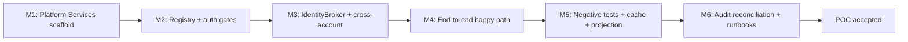
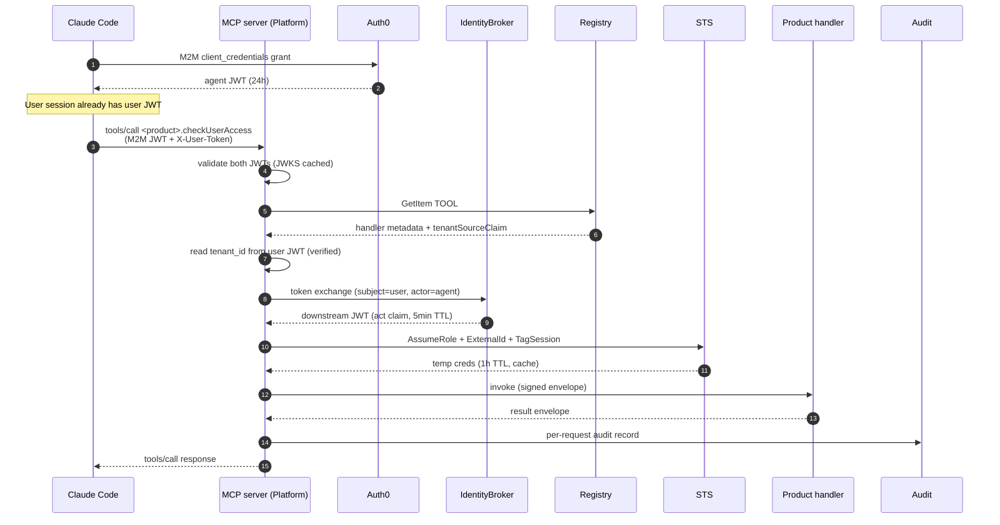

# Phase-1 POC scope — one product, one handler, one agent

The POC validates the core flow end-to-end with the smallest meaningful slice. It is **milestone-level** — acceptance criteria, sequenced milestones, and a token-flow sequence diagram. It does not include IAM JSON or Lambda code; the implementation team owns those. The goal is a defensible go / no-go input for the broader rollout.

## Scope

- **One product.** First product to onboard (`[ASSUMED]` — TBD by stakeholders; recommendation is the simplest of the four product accounts).
- **One handler.** `<product>.checkUserAccess` (or equivalent read-only lookup). Returns whether a user has access to the product for a tenant. Read-only, idempotent, low cardinality, well-suited to caching.
- **One agent.** Claude Code internal session, authenticated with a single Auth0 M2M client (`claude-code-internal`).

## What is explicitly in scope

- HTTP/SSE MCP server in Platform Services account, conforming to MCP 2025-06-18 authorization spec.
- DynamoDB Handler Registry with one item: `pk = TOOL#<product>.checkUserAccess`, `sk = VERSION#1.0.0`.
- Auth0 M2M JWT validation at the MCP server.
- IdentityBroker prototype implementing the RFC 8693 token-exchange contract — V1 fallback (Auth0 Action **or** Platform-owned KMS-signed JWT, whichever resolves Open Question Q1 fastest).
- `sts:AssumeRole` cross-account into the chosen product account, with **per-product External ID** + `aws:PrincipalOrgID`-conditioned trust policy.
- Cross-account Lambda invocation of the handler.
- Audit log record in Platform Services CloudWatch Logs covering agent → user → tool → handler → tenant → outcome → latency.
- Server-side `tools/list` projection — even with one tool, the projection logic ships in the POC so it is exercised before the second tool lands.
- Layered caching: 5-min in-process registry cache, 1-h STS session cache, 23-h Auth0 M2M token cache. ElastiCache deferred to milestone 5.
- One-page on-call boundary doc inherited from [`01-architecture.md`](01-architecture.md).

## What is explicitly out of POC scope

- Multi-region deployment.
- Provisioned concurrency on the MCP-server Lambda.
- Multi-handler `tools/list` aggregation testing (only one handler).
- Step Functions and ECS handler substrates (only Lambda).
- Federation / `handlerType: "remote-mcp"` adapter (reserved field is in the registry schema; no implementation).
- V2 mutating-write enforcement (the `sideEffects: "read"` gate ships, but no `"write"` test path).
- Customer-facing exposure or compliance certification.

## Acceptance criteria

The POC is **green** when all of the following hold:

1. **End-to-end success.** A Claude Code agent invokes `<product>.checkUserAccess(userId, tenantId)`. The MCP server validates the agent's M2M JWT, validates the user's token, exchanges tokens via the IdentityBroker, looks up the handler via the registry, AssumeRoles into the product account with the per-product External ID, invokes the handler Lambda, returns the result to the agent, and writes the audit record.

2. **Audit record completeness.** The audit log entry shows the full chain: agent `client_id`, user `sub`, tool `id` and `version`, handler `arn` and `assume_role_arn`, `tenant_id`, decision (`allow`), `latency_ms` per stage, total latency, and `request_id` matching the AWS CloudTrail entries in both Platform Services and the product account.

3. **Tenant-scope enforcement.** A test that calls `<product>.checkUserAccess(userId="x", tenantId="acme")` with a user JWT whose `tenant_id` claim is `globex` is rejected at the MCP server with `class=AUTH, code=TENANT_SCOPE_VIOLATION` — **before** any STS call. The audit record shows `decision=deny, denial_reason=tenant_scope`.

4. **Registry write enforcement.** A registry write attempt for `sideEffects: "write"` is rejected by the registration API. A registry write attempt without `tenantSourceClaim` is rejected. A registry write whose `assumeRoleArn` is not in the account allowlist is rejected.

5. **Cache effectiveness.** A second invocation of `<product>.checkUserAccess` within 5 minutes shows zero DynamoDB GetItem calls (in-process registry cache hit) and zero `sts:AssumeRole` calls (STS session cache hit). Total latency P50 ≤ 250 ms; P95 ≤ 800 ms.

6. **Cold-path latency.** First invocation after MCP-server cold start completes within P95 ≤ 1500 ms.

7. **`tools/list` projection.** A second M2M client connecting to the MCP server with a different `client_id` (and a registry filter that excludes it) does **not** see `<product>.checkUserAccess` in `tools/list`. Confirms the projection lever before the second tool ships.

8. **Token passthrough refusal.** A test that injects the agent's M2M JWT into the handler's input is rejected by the MCP server before invocation. The MCP server only forwards the IdentityBroker-issued downstream token.

9. **`/.well-known/oauth-protected-resource` self-host.** The MCP server's `.well-known` endpoint returns the resource-server metadata document; on 401, the `WWW-Authenticate` header points clients at it. This closes Phase A gap #1 by design and is verified independently of Auth0 RFC 9728 support.

10. **Documentation parity.** The POC ships with: the on-call boundary doc, a runbook for "MCP server unavailable — operate without agent automation," and a runbook for "tenant-scope rejection in production" (false-positive triage).

## Milestones

### M1 — Platform Services scaffold

- API Gateway HTTP API + Lambda for the MCP server (single region, multi-AZ).
- `/.well-known/oauth-protected-resource` endpoint returning the metadata document.
- Auth0 M2M client `claude-code-internal` registered. JWKS validation in the Lambda. Health check endpoint reachable.
- Platform Services CloudWatch Logs group with retention configured.
- **Exit criterion.** A signed M2M JWT from `claude-code-internal` reaches the MCP server and is validated; an unsigned or expired JWT is rejected with the correct `WWW-Authenticate` header.

### M2 — Registry + auth gates

- DynamoDB Handler Registry table with single-table schema and the three GSIs.
- Registration API (Lambda + API Gateway) enforcing: `tenantSourceClaim` required, `sideEffects: "read"` only, `assumeRoleArn` in account allowlist, owner team in directory.
- Server-side `tools/list` projection by `client_id`.
- **Exit criterion.** A `tools/list` call from `claude-code-internal` returns the registered handler. A second M2M client not in the projection returns an empty list. Registration rejects all four bad-input classes from criterion #4.

### M3 — IdentityBroker + cross-account

- IdentityBroker Lambda implementing the RFC 8693 wire shape (subject_token + actor_token → output JWT with `act` claim, ≤ 5-min TTL).
- V1 implementation chosen between (Auth0 Action) or (KMS-signed JWT) based on the answer to Open Question Q1.
- Per-product External ID generated and stored in the registry's product table.
- Trust policy on the product account's `PlatformMcpInvoker` role: principal = `PlatformMcpServer` role; condition = External ID + `aws:PrincipalOrgID`.
- STS session caching in the MCP server, keyed on `(productAccount, externalId)`.
- **Exit criterion.** The MCP server, given a valid agent + user token pair, exchanges them via the IdentityBroker and AssumeRoles into the product account. STS session tags carry `tenant_id`, `user_sub`, `agent_client_id`, `request_id`. CloudTrail in the product account confirms the assumption.

### M4 — End-to-end happy path

- Handler Lambda registered in the product account with one of the platform's `@linq/mcp-handler-sdk` envelope wrappers. Returns a structured payload validated against the registry's `outputSchema`.
- MCP server invokes the handler with the IdentityBroker token, the validated input envelope, and the dispatcher's per-handler retry policy.
- Audit log record written with the full chain.
- **Exit criterion.** Acceptance criteria 1, 2, 5, and 6 hold for a real test request against a real tenant in the chosen product account.

### M5 — Negative tests + cache + projection

- Tenant-scope violation test (criterion 3).
- Token passthrough refusal test (criterion 8).
- Cache effectiveness test (criterion 5 second invocation).
- `tools/list` projection test (criterion 7).
- **Exit criterion.** All four negative / cache / projection tests pass and are wired into a CI suite that runs on every MCP-server deploy.

### M6 — Audit reconciliation + runbooks

- Cross-account log shipping (CloudWatch subscription filter → Firehose → S3 with Object Lock) plumbed.
- Daily reconciliation job comparing MCP-server request count to audit-log row count.
- Three runbooks: MCP server unavailable; tenant-scope rejection triage; on-call boundary matrix.
- **Exit criterion.** Audit log delivery lag < 5 min for 7 consecutive days. All three runbooks reviewed by the Platform on-call rotation.

## Token flow at POC scale

## What goes / no-goes from POC

If the POC achieves all 10 acceptance criteria, the design is validated and broader rollout proceeds: each remaining product onboards a small handful of read handlers under the same pattern, the registry's CI gate handles per-handler ergonomics, and the four blocking open questions ([`05-open-questions.md`](05-open-questions.md)) close as part of broader rollout.

If the POC fails on **R4 (catalog leak), R7 (availability), or R6 (Auth0 M2M cost)** specifically — these three are HIGH-severity risks the POC is designed to validate — re-open the architecture with the failed lesson written into a follow-up ADR.

If the POC fails on the IdentityBroker contract specifically (Open Question Q1 unresolves under load), the fallback is to ship V1 with the option (c) fallback from [`role-passes/security-iam.md`](role-passes/security-iam.md) — agent-as-a-whole authorization with no user-level RBAC — and document the consequence explicitly. **This is a regression in agent UX and must not happen silently.**
