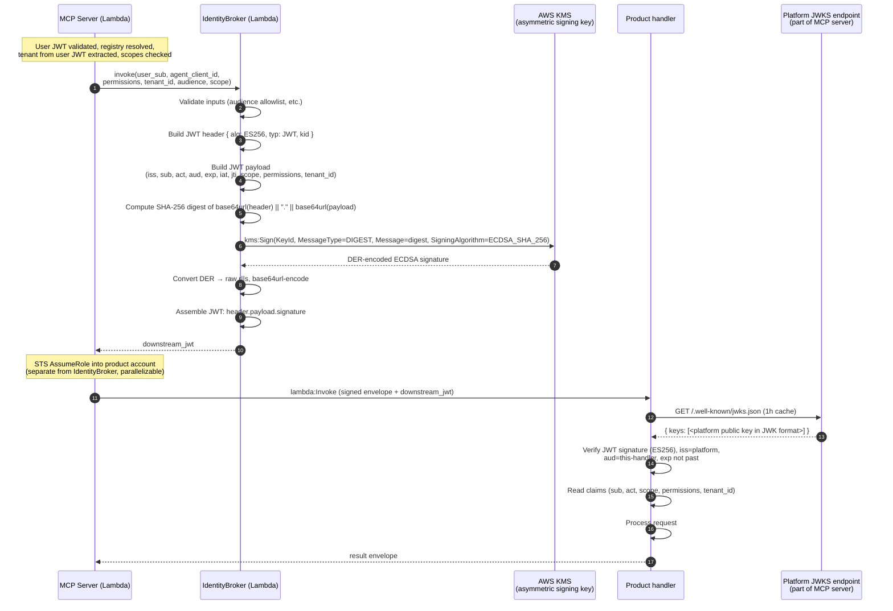

# Deep dive — IdentityBroker implementation (Path C, KMS-signed JWT)

**Status:** Educational / further reading. Locks the V1 IdentityBroker implementation choice. Not part of the formal review record.
**For:** [Decision 0015 — Centralized Platform MCP Server](../../../decisions/0015-centralized-platform-mcp.md). Backed by review artifacts in [`docs/research/0015-centralized-platform-mcp/`](../00-overview.md). Resolves [Open Question Q1](../05-open-questions.md).
**Date:** 2026-05-04

This document explains why the V1 IdentityBroker uses a Platform-owned KMS-signed JWT (Path C) instead of Auth0's native RFC 8693 token-exchange grant (Path A), how Path C is designed concretely, and why the wire-shape compatibility means future migration to native RFC 8693 is a non-breaking change.

## Why Path C, not Path A

Auth0 Enterprise supports the RFC 8693 token-exchange grant, but **as of 2026-05-04 the feature is in early access**. Production-critical paths should not depend on early-access features for these reasons:

- **No SLA.** Early-access features don't carry the same uptime guarantee as GA Auth0 features. An early-access path failing during a LINQ incident lands without escalation parity.
- **Behavior may change.** Early-access feature contracts (request shapes, claim names, error semantics) can shift between Auth0 releases. Production code coupled to the early-access shape becomes an upgrade liability.
- **Limited observability and tooling.** Auth0's logs, dashboards, and rate-limit visibility tend to lag for early-access features. Diagnosing a production issue takes longer.
- **Vendor support escalation parity.** Auth0 support engagements for early-access features are best-effort, not contractual.

These are general operational hygiene rules, not Auth0-specific complaints. The same reasoning applies to AWS preview services, GitHub Actions beta features, or any vendor-side capability that hasn't stabilized.

The natural alternative is to **issue the JWT ourselves** while preserving the same wire shape downstream handlers expect. That's Path C.

## The key insight

RFC 8693 defines **two separable things**:

1. **A grant type:** `urn:ietf:params:oauth:grant-type:token-exchange`. The protocol Auth0 has in early access.
2. **A JWT shape:** `sub` claim + `act` claim chain + audience binding + bounded TTL. A standard JWT pattern, fully supported by every JOSE library since 2015.

You can use one without the other. Path C constructs and signs the JWT ourselves; the resulting JWT is bit-for-bit indistinguishable from one Auth0's RFC 8693 grant would produce. Handlers validate them identically.

This decouples the design from Auth0's release timeline without sacrificing wire-shape portability.

## V1 design

Three small components in the Platform Services account.

### Component 1 — KMS asymmetric signing key

- **Algorithm:** ECDSA P-256 (`ECC_NIST_P256`) recommended over RSASSA-PSS-SHA-256. Reasons: smaller signature size (~64 bytes vs. 256 bytes), faster `kms:Sign` calls (~3–5ms vs. ~10–15ms), and standard `ES256` JWT alg supported by every JOSE library.
- **Key policy:** only the IdentityBroker Lambda's execution role has `kms:Sign`. Nobody else, including platform admins, can invoke `kms:Sign`. Key administrators (separate IAM principals) have only `kms:Describe*`, `kms:GetPublicKey`, and key-rotation actions.
- **Rotation cadence:** annual. KMS supports manual rotation for asymmetric keys (creates a new CMK; the old CMK retained for verification of in-flight tokens until their TTL expires).
- **Cost:** $1/month per key + $0.03 per 10,000 sign operations. At 5K req/day → ~$5/month total. Negligible.
- **Failure mode it protects:** a compromised IdentityBroker Lambda can sign JWTs but cannot exfiltrate the private key (KMS doesn't release private key material). A compromised platform admin role cannot sign JWTs (no `kms:Sign` permission).

### Component 2 — IdentityBroker Lambda

A small stateless Lambda whose only job is JWT assembly and signing.

**Inputs (from MCP server):**
- `user_sub` — Auth0 user `sub` claim (`auth0|alice`).
- `agent_client_id` — the OAuth client_id (Claude Desktop's dynamically-registered ID, or the M2M client_id for headless agents).
- `permissions` — the user's Auth0 RBAC permissions for this product (filtered to `requiredPermissions[]` from registry).
- `tenant_id` — read from the user's verified JWT's `tenantSourceClaim`.
- `audience` — the handler's audience identifier from registry.
- `scope` — the M2M scope set (or empty for per-user OAuth model).

**Output:** signed JWT string.

**Lambda runtime:** Node 20 with TypeScript or Python 3.12 (match the MCP server's runtime choice).

**Code structure (sketch):**
```
src/identity-broker/
  index.ts                # Lambda entry
  jwt.ts                  # JWT header + payload assembly
  signer.ts               # KMS Sign integration
  validation.ts           # Input validation; reject malformed requests
  errors.ts               # Error envelope shared with MCP server
```

**Validation logic (rejects before signing):**
- Audience must match a registered handler audience (lookup against the registry's audience allowlist).
- `permissions[]` must be non-empty.
- `tenant_id` must be present and non-empty.
- `user_sub` must match Auth0 `sub` format.
- Optional: blocklist check against a DynamoDB table of revoked user_subs (defer to V2 if not needed at POC).

**The Lambda's IAM execution role:**
- `kms:Sign` on the IdentityBroker key only.
- `kms:GetPublicKey` on the IdentityBroker key (cached at cold start; used by the JWKS endpoint).
- CloudWatch Logs write.
- Optional: DynamoDB read on the audience-allowlist table.

### Component 3 — JWKS endpoint hosted by the MCP server

- **Path:** `/.well-known/jwks.json` on the MCP server.
- **Returns:** the IdentityBroker's public key in JWK format.
- **Caching:** standard `Cache-Control: public, max-age=3600` (1 hour). Most JWT-validating handlers cache JWKS aggressively.
- **Public key fetched once at MCP server cold start** via `kms:GetPublicKey`. KMS returns the public key as DER-encoded SubjectPublicKeyInfo; convert to JWK format on first request and cache in process.
- **Rotation handling:** when the KMS key rotates, the JWKS endpoint serves *both* the old and new public keys (with different `kid` values) until the old key's last issued JWT expires (≤ 5 min after the rotation, given the JWT TTL).

## JWT wire shape

The JWT the MCP server passes to the handler:

```
Header (base64url-encoded JSON):
  {
    "alg": "ES256",
    "typ": "JWT",
    "kid": "kms-key-id-2026-q2"
  }

Payload (base64url-encoded JSON):
  {
    "iss": "https://mcp.linq.platform",
    "sub": "auth0|alice",
    "act": {
      "sub": "claude-desktop-client-id-uuid"
    },
    "aud": "https://erp-handler.linq.platform",
    "exp": 1714839847,
    "iat": 1714839547,
    "jti": "req-<uuid>",
    "scope": "erp:read",
    "permissions": ["erp:read:user"],
    "tenant_id": "acme"
  }

Signature: ECDSA P-256 signature of header || "." || payload, base64url-encoded
```

This is a standard RFC 8693 JWT. A handler's JWT-validation library doesn't know or care that Auth0 didn't issue it; it validates the signature against the platform JWKS, checks `iss`, `aud`, `exp`, and reads claims.

The `act` claim chain is the OBO record. For audit, a handler logs `sub` (the user) and `act.sub` (the agent acting on the user's behalf). Multi-hop chains (agent A delegates to agent B) extend `act` recursively per RFC 8693:
```
"act": { "sub": "agent-B", "act": { "sub": "agent-A" } }
```
V1 doesn't need multi-hop, but the shape supports it.

## Request flow



The IdentityBroker invocation can run **in parallel with the STS AssumeRole step** since they're independent. Cuts ~50ms off cold-path latency.

## Comparison with Path A (native Auth0 RFC 8693)

| Concern | Path A — Auth0 RFC 8693 native | Path C — Platform KMS-signed (V1 choice) |
|---|---|---|
| **Auth0 dependency for OBO step** | Hard — every exchange round-trips Auth0 | Soft — only inbound user-JWT validation needs Auth0 JWKS (cacheable 1h) |
| **Production risk from early-access status** | Real — feature behavior may change without notice | Zero — KMS + JOSE are GA since 2014 / 2015 |
| **Latency added per request** | ~50–150 ms (Auth0 round-trip; cacheable for token TTL) | ~10–30 ms (KMS sign; parallelizable with STS AssumeRole) |
| **Key management** | Auth0 owns | Platform owns (KMS automates) |
| **JWT wire shape** | RFC 8693 standard | RFC 8693 standard (identical) |
| **Handler verification logic** | Validate against Auth0 JWKS | Validate against platform JWKS |
| **Handler trust roots** | One (Auth0) | Two (Auth0 for inbound user JWT, Platform for downstream) |
| **Audit chain (`act` claim)** | Auth0 issues; well-tested | Platform issues; you control schema |
| **Auth0 outage during request** | Stops new exchanges (cached tokens still work for ≤ 5 min) | Doesn't matter once inbound user JWT was validated |
| **Cost** | Per Auth0 plan | ~$5/month at V1 scale |
| **Audit traceability** | Auth0 logs every exchange | CloudTrail logs every KMS Sign call |
| **Signing-key blast radius** | Auth0's | Bounded by KMS IAM policy |
| **Future migration** | N/A (already there) | Swap broker implementation; handlers unchanged |

The two paths are operationally equivalent on every dimension that matters for V1 read-only internal-only scope, **except** Path C is independent of Auth0's release timeline.

## Future migration story (if Auth0 GAs RFC 8693)

If Auth0 promotes RFC 8693 to GA at some point and LINQ wants to migrate:

1. **Handlers don't change.** The JWT wire shape is identical; handler-side JWKS can include both Auth0's signing keys and the platform's, accepting either.
2. **MCP server doesn't change.** The IdentityBroker is the only component swapped.
3. **IdentityBroker swap:** replace the `kms:Sign` call with an HTTP POST to Auth0's `/oauth/token` with `grant_type=urn:ietf:params:oauth:grant-type:token-exchange`. ~50 lines of code change.
4. **Cutover plan:** dual-issue (both platform and Auth0) for one TTL window (≤ 5 min) so any in-flight tokens drain. Then cut the platform issuance off.
5. **Trigger condition for the migration:** Auth0 RFC 8693 reaches GA *and* LINQ has a concrete operational win from migrating (e.g., centralized Auth0 logging that platform-side audit doesn't replicate).

The migration is a code change, not a protocol change. **No coordinated handler-team upgrade required.**

## Operational considerations

### Latency
- KMS Sign: ~3–5 ms warm, ~30 ms first-call cold.
- IdentityBroker Lambda cold start: ~200 ms warm-pool / ~1s without provisioned concurrency.
- Parallelize IdentityBroker invocation with STS AssumeRole; both depend only on the registry-resolved metadata.
- Net latency cost vs. Path A: roughly equal warm-path; Path C wins cold-path because it doesn't make an outbound HTTP call.

### Cost
- KMS asymmetric key: $1/month + $0.03/10K Sign operations.
- IdentityBroker Lambda invocations: ~5K/day × 200ms × 128MB = $0.03/month at V1 scale. Trivial.
- At 10× growth (3-year target): KMS ~$1.50/month sign cost. Still trivial.
- The cost driver is and remains the user's M2M Auth0 app subscription, not the IdentityBroker.

### Key rotation
- Annual rotation cadence. Document in the platform team's calendar.
- Rotation procedure:
  1. Create new KMS key (V2).
  2. Update IdentityBroker Lambda env var to point at V2; deploy.
  3. JWKS endpoint serves both V1 and V2 public keys (different `kid`s).
  4. Wait 5+ minutes (max JWT TTL) for V1-signed tokens to drain.
  5. Disable V1 key (`Disable` action; not deletion — KMS retains for verification audit).
  6. After 30 days, schedule V1 key deletion.
- Key compromise procedure: same flow, accelerated. Disable V1 immediately; tokens currently in-flight expire in ≤ 5 min.

### JWKS endpoint resilience
- The JWKS endpoint is a critical dependency for handlers. If it's down, handlers can't verify any IdentityBroker JWTs.
- Mitigation: handlers cache JWKS aggressively (1h `Cache-Control`). Operating-without-platform mode allows handlers to keep accepting JWTs for the cache window during platform outages.
- The JWKS endpoint is part of the MCP server itself (not a separate service), so it has the same availability profile as the rest of the platform. No additional failure surface.

### Audit
- Every `kms:Sign` call appears in CloudTrail with the IdentityBroker Lambda's role as the principal and the request_id in the encryption context.
- The platform-side per-request audit log records the IdentityBroker invocation alongside the rest of the chain.
- Handler-side logs include `sub` and `act.sub` from the JWT; correlated to the platform audit via `jti = request_id`.
- For SOC 2 scope (V2+): the audit chain is "platform issued JWT [audit log + CloudTrail entry] → handler accepted JWT [handler log + CloudTrail entry]." Self-contained; no external Auth0 audit dependency for the OBO step.

## Trade-offs the platform owns explicitly

These are the trade-offs the platform team accepts by choosing Path C:

1. **Two trust roots for handlers.** Handlers trust Auth0's JWKS (for the inbound user JWT validation step, only relevant for handlers that also do their own user-JWT validation — most won't) and the platform's JWKS (for the downstream JWT). Documented in the platform handler SDK.
2. **Platform owns key lifecycle.** KMS key rotation, key compromise response, JWKS endpoint availability are platform-team responsibilities. Mitigated by KMS automation and the JWKS-as-part-of-MCP-server design.
3. **Slightly larger blast radius for platform compromise.** A compromised IdentityBroker Lambda can issue arbitrary JWTs for any registered handler audience. Mitigated by KMS Sign permission scoped only to the IdentityBroker role and the audience-allowlist validation step.
4. **Non-Auth0-issued tokens require explicit handler trust.** Handler engineers must trust the platform's signing identity. Easier than trusting Auth0 in some respects (the platform is internal LINQ infrastructure) and harder in others (Auth0 is a known specialized identity vendor).

## Why this is the right V1 choice

- **Operational maturity.** No early-access dependency; uses primitives stable for a decade.
- **Low cost.** ~$5/month at V1 scale.
- **Low latency.** Comparable to Path A; better cold path.
- **Wire compatibility.** Future migration to native RFC 8693 is non-breaking.
- **Self-contained audit.** No external Auth0 audit dependency for the OBO step.
- **Decoupled outage profile.** Auth0 outage during request handling doesn't stop in-flight requests once the inbound user JWT was validated.

## Related artifacts

- [`role-passes/security-iam.md`](../role-passes/security-iam.md) — original security-lens findings on identity propagation.
- [`role-passes/platform.md`](../role-passes/platform.md) — invocation envelope shape.
- [`01-architecture.md`](../01-architecture.md) — sequence diagrams for warm/cold path.
- [`05-open-questions.md`](../05-open-questions.md) — Q1 reframed as resolved by this design.
- [`knowledge/wiki/entities/oauth-token-exchange.md`](../../../../knowledge/wiki/entities/oauth-token-exchange.md) — RFC 8693 protocol reference.
- [`knowledge/wiki/entities/auth0-m2m.md`](../../../../knowledge/wiki/entities/auth0-m2m.md) — Auth0 M2M client credentials reference.
