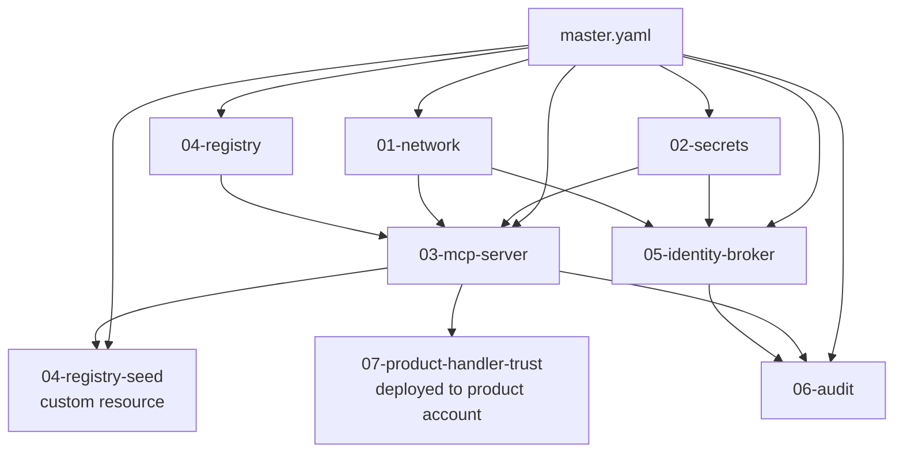

# Implementation 01 — CloudFormation Stack Hierarchy

**Decision:** [`0015-centralized-platform-mcp`](../../../decisions/0015-centralized-platform-mcp.md) — Phase B IaC backbone.
**Owner:** 11-eng-cloudops (CloudOps Engineer).
**Status:** Draft for Phase B implementation.
**Effort estimate:** `4 d [ASSUMED]`.

## 1. Overview

This artifact specifies the CloudFormation backbone for the Phase-1 POC of the LINQ Platform MCP Server. It defines a master template plus seven nested stacks (`01-network`, `02-secrets`, `03-mcp-server`, `04-registry`, `05-identity-broker`, `06-audit`, `07-product-handler-trust`), the parameter schema each stack consumes, the cross-stack reference contract via `Outputs` + `Fn::ImportValue`, the deployment ordering enforced by master-template `DependsOn`, the drift-detection rule fired daily via EventBridge Scheduler, and the stuck-stack recovery posture. Templates target single-region `us-east-1` multi-AZ. CloudFormation StackSets are deferred to M2 — V1 has one product account, so cross-account replication is a single `07-product-handler-trust` stack assumed by the GitHub Actions OIDC role into that account. Every YAML excerpt below is structured to pass `cfn-lint --info` with zero `E` errors and `cfn-nag` with no `FAIL` findings; `WARN` findings are inline-justified.

## 2. Concrete artifacts

### 2.1 Stack hierarchy and dependency-ordering diagram (CC-3)



Linearized deploy order — enforced by `DependsOn` in `master.yaml`:

`01-network → 02-secrets → 04-registry → 03-mcp-server → 05-identity-broker → 06-audit → 04-registry-seed → 07-product-handler-trust`

The registry **table** deploys before `03-mcp-server` so the broker's `RegistryTableArn` import resolves at create-time. The registry **seed** custom resource fires after `03-mcp-server` is up so the broker can publish `notifications/tools/list_changed` on first item load (R11). `07-product-handler-trust` deploys last, into the product account, after the Platform Services principal ARN is exportable from `03-mcp-server`. [CONFIRMED-by-ADR via CC-3].

### 2.2 Master template excerpt — `infrastructure/master.yaml`

```yaml
AWSTemplateFormatVersion: "2010-09-09"
Description: Platform MCP Server — master template orchestrating nested stacks (Decision 0015).
Transform: AWS::Serverless-2016-10-31

Parameters:
  Environment:
    Type: String
    AllowedValues: [dev, stage, prod]
    Description: Deploy environment; selects parameter file and resource naming suffix.
  PlatformAccountId:
    Type: String
    AllowedPattern: "^[0-9]{12}$"
    Description: AWS account ID hosting the Platform Services stack.
  ProductAccountId:
    Type: String
    AllowedPattern: "^[0-9]{12}$"
    Description: AWS account ID for the V1 POC product (one account in V1 — Q3 [ASSUMED]).
  LoggingAccountId:
    Type: String
    AllowedPattern: "^[0-9]{12}$"
    Description: Centralized logging-OU account ID (Q4 [ASSUMED]).
  Auth0IssuerUrl:
    Type: String
    Description: Auth0 tenant URL, e.g., https://linq-dev.us.auth0.com/
  McpAudience:
    Type: String
    Default: https://mcp.linq.platform
    Description: RFC 8707 audience binding for the MCP server (R19).
  CustomDomainName:
    Type: String
    Default: ""
    Description: Optional custom DNS for the MCP API; empty disables Route 53 mapping in V1.
  TemplateBucket:
    Type: String
    Description: S3 bucket name where nested stack TemplateURL files were uploaded by CI.

Resources:
  NetworkStack:
    Type: AWS::CloudFormation::Stack
    Properties:
      TemplateURL: !Sub "https://${TemplateBucket}.s3.amazonaws.com/${Environment}/01-network.yaml"
      Parameters:
        Environment: !Ref Environment

  SecretsStack:
    Type: AWS::CloudFormation::Stack
    DependsOn: NetworkStack
    Properties:
      TemplateURL: !Sub "https://${TemplateBucket}.s3.amazonaws.com/${Environment}/02-secrets.yaml"
      Parameters:
        Environment: !Ref Environment
        Auth0IssuerUrl: !Ref Auth0IssuerUrl

  RegistryStack:
    Type: AWS::CloudFormation::Stack
    DependsOn: SecretsStack
    Properties:
      TemplateURL: !Sub "https://${TemplateBucket}.s3.amazonaws.com/${Environment}/04-registry.yaml"
      Parameters:
        Environment: !Ref Environment

  McpServerStack:
    Type: AWS::CloudFormation::Stack
    DependsOn: [SecretsStack, NetworkStack, RegistryStack]
    Properties:
      TemplateURL: !Sub "https://${TemplateBucket}.s3.amazonaws.com/${Environment}/03-mcp-server.yaml"
      Parameters:
        Environment: !Ref Environment
        Auth0IssuerUrl: !Ref Auth0IssuerUrl
        McpAudience: !Ref McpAudience
        CustomDomainName: !Ref CustomDomainName

  IdentityBrokerStack:
    Type: AWS::CloudFormation::Stack
    DependsOn: [SecretsStack, NetworkStack, McpServerStack]
    Properties:
      TemplateURL: !Sub "https://${TemplateBucket}.s3.amazonaws.com/${Environment}/05-identity-broker.yaml"
      Parameters:
        Environment: !Ref Environment
        McpAudience: !Ref McpAudience

  AuditStack:
    Type: AWS::CloudFormation::Stack
    DependsOn: [McpServerStack, IdentityBrokerStack]
    Properties:
      TemplateURL: !Sub "https://${TemplateBucket}.s3.amazonaws.com/${Environment}/06-audit.yaml"
      Parameters:
        Environment: !Ref Environment
        LoggingAccountId: !Ref LoggingAccountId

  RegistrySeedStack:
    Type: AWS::CloudFormation::Stack
    DependsOn: [McpServerStack, RegistryStack]
    Properties:
      TemplateURL: !Sub "https://${TemplateBucket}.s3.amazonaws.com/${Environment}/04-registry-seed.yaml"
      Parameters:
        Environment: !Ref Environment
        ProductAccountId: !Ref ProductAccountId

Outputs:
  PlatformMcpServerRoleArn:
    Description: Platform-side principal that AssumeRoles into product accounts (R2).
    Value: !GetAtt McpServerStack.Outputs.PlatformMcpServerRoleArn
    Export:
      Name: !Sub "platform-mcp-server-role-arn-${Environment}"
```

### 2.3 Worked nested-stack example — `03-mcp-server.yaml`

```yaml
AWSTemplateFormatVersion: "2010-09-09"
Description: Platform MCP Server nested stack — API Gateway HTTP API, Lambda, role.
Transform: AWS::Serverless-2016-10-31

Parameters:
  Environment:           { Type: String, AllowedValues: [dev, stage, prod] }
  Auth0IssuerUrl:        { Type: String }
  McpAudience:           { Type: String }
  CustomDomainName:      { Type: String, Default: "" }

Conditions:
  HasCustomDomain: !Not [ !Equals [ !Ref CustomDomainName, "" ] ]

Resources:
  # R7 — multi-AZ via VPC subnet selection across two AZs.
  McpLambdaSecurityGroup:
    Type: AWS::EC2::SecurityGroup
    Properties:
      GroupDescription: Egress for MCP server Lambda — Auth0 JWKS, STS, Lambda invoke.
      VpcId:
        Fn::ImportValue: !Sub "platform-mcp-vpc-${Environment}"
      SecurityGroupEgress:
        - { IpProtocol: tcp, FromPort: 443, ToPort: 443, CidrIp: 0.0.0.0/0,
            Description: HTTPS egress to Auth0, STS, AWS service endpoints. }

  PlatformMcpServerRole:
    Type: AWS::IAM::Role
    Properties:
      RoleName: !Sub "PlatformMcpServer-${Environment}"
      AssumeRolePolicyDocument:
        Version: "2012-10-17"
        Statement:
          - Effect: Allow
            Principal: { Service: lambda.amazonaws.com }
            Action: sts:AssumeRole
      ManagedPolicyArns:
        - arn:aws:iam::aws:policy/service-role/AWSLambdaVPCAccessExecutionRole
      Policies:
        - PolicyName: registry-read
          PolicyDocument:
            Version: "2012-10-17"
            Statement:
              - Effect: Allow
                Action: [ dynamodb:GetItem, dynamodb:Query ]
                Resource:
                  - Fn::ImportValue: !Sub "platform-mcp-registry-table-${Environment}"
                  - !Sub
                    - "${TableArn}/index/*"
                    - TableArn:
                        Fn::ImportValue: !Sub "platform-mcp-registry-table-${Environment}"
        - PolicyName: assume-product-invoker
          PolicyDocument:
            Version: "2012-10-17"
            Statement:
              - Effect: Allow
                Action: sts:AssumeRole
                # Trust details (External ID, OrgID) are enforced on the product side.
                Resource: "arn:aws:iam::*:role/PlatformMcpInvoker"

  McpFunction:
    Type: AWS::Serverless::Function
    Properties:
      FunctionName: !Sub "platform-mcp-server-${Environment}"
      Runtime: nodejs20.x
      Handler: index.handler
      CodeUri: ../../src/mcp-server/
      MemorySize: 512
      Timeout: 30
      Architectures: [arm64]
      ReservedConcurrentExecutions: 50
      Role: !GetAtt PlatformMcpServerRole.Arn
      VpcConfig:
        SecurityGroupIds: [ !Ref McpLambdaSecurityGroup ]
        # R7 — explicit two-AZ subnet selection guarantees Lambda ENIs land multi-AZ.
        SubnetIds:
          - Fn::ImportValue: !Sub "platform-mcp-private-subnet-a-${Environment}"
          - Fn::ImportValue: !Sub "platform-mcp-private-subnet-b-${Environment}"
      Environment:
        Variables:
          AUTH0_ISSUER:    !Ref Auth0IssuerUrl
          MCP_AUDIENCE:    !Ref McpAudience
          # R16 — secrets via {{resolve}}; no plain-text material in CFN params.
          AUTH0_CLIENT_ID: !Sub "{{resolve:secretsmanager:platform-mcp/${Environment}/auth0:SecretString:client_id}}"
          REGISTRY_TABLE:
            Fn::ImportValue: !Sub "platform-mcp-registry-table-name-${Environment}"

  McpApi:
    Type: AWS::Serverless::HttpApi
    Properties:
      StageName: !Ref Environment
      DefaultRouteSettings: { ThrottlingBurstLimit: 200, ThrottlingRateLimit: 100 }
      AccessLogSettings:
        DestinationArn: !GetAtt ApiAccessLogGroup.Arn
        Format: '{ "requestId":"$context.requestId", "ip":"$context.identity.sourceIp",
                   "status":"$context.status", "latency":"$context.responseLatency" }'

  ApiAccessLogGroup:
    Type: AWS::Logs::LogGroup
    Properties:
      LogGroupName: !Sub "/aws/apigw/platform-mcp-${Environment}"
      RetentionInDays: 400

Outputs:
  PlatformMcpServerRoleArn:
    Value: !GetAtt PlatformMcpServerRole.Arn
    Export: { Name: !Sub "platform-mcp-server-role-arn-${Environment}" }
  ApiEndpoint:
    Value: !Sub "https://${McpApi}.execute-api.${AWS::Region}.amazonaws.com/${Environment}"
    Export: { Name: !Sub "platform-mcp-api-endpoint-${Environment}" }
```

`cfn-nag` rule W89 (Lambda outside VPC) is satisfied by `VpcConfig`. W92 (reserved concurrency) is satisfied by `ReservedConcurrentExecutions: 50` (cost-reliability open-question default). Lambda log retention is owned by stack `06-audit` to avoid double-managing the function's auto-created log group.

### 2.4 Parameter schema (per-environment)

Stored under `infrastructure/params/<env>.json`; supplied to `aws cloudformation deploy --parameter-overrides`. CI substitutes `*AccountId` values from the OIDC-claim account map.

| Parameter | Source | dev | stage | prod | Notes |
|---|---|---|---|---|---|
| `Environment` | env-pinned literal | `dev` | `stage` | `prod` | Suffix on every named resource. |
| `PlatformAccountId` | OIDC claim | `111111111111` | `222222222222` | `333333333333` | `[ASSUMED]`. |
| `ProductAccountId` | OIDC claim | `444444444444` | `555555555555` | `666666666666` | V1 single product, Q3 `[ASSUMED]`. |
| `LoggingAccountId` | OIDC claim | `777777777777` | `777777777777` | `777777777777` | Shared logging-OU account, Q4 `[ASSUMED]`. |
| `Auth0IssuerUrl` | `params/<env>.json` | `https://linq-dev.us.auth0.com/` | `https://linq-stage.us.auth0.com/` | `https://linq.us.auth0.com/` | Trailing slash required by `jose`. |
| `McpAudience` | env-pinned literal | `https://mcp.linq.platform` | same | same | RFC 8707 audience binding (R19). |
| `CustomDomainName` | `params/<env>.json` | `""` | `""` | `mcp.linq.com` | V1 dev/stage skip Route 53. |
| `TemplateBucket` | CI artifact bucket | `linq-cfn-artifacts-dev` | `linq-cfn-artifacts-stage` | `linq-cfn-artifacts-prod` | KMS-encrypted; OIDC-deployer-only access. |

Secrets (Auth0 client secret, KMS aliases) **never** appear in `Parameters`. They are read at runtime via `{{resolve:secretsmanager:platform-mcp/<env>/auth0:SecretString:client_id}}` from secrets provisioned in `02-secrets`. This protects R16 (no manual session caches in CFN — sessions are runtime concerns) and the broader "no plain-text in CFN params" platform contract — see [Use dynamic references — AWS CloudFormation User Guide](https://docs.aws.amazon.com/AWSCloudFormation/latest/UserGuide/dynamic-references.html).

### 2.5 Cross-stack reference contract

Every nested stack publishes the minimal set of identifiers other stacks consume. Imports are resolved at create-time, not runtime, so circular references between nested stacks are impossible by construction.

| Producer stack | Export name | Type | Consumed by |
|---|---|---|---|
| `01-network` | `platform-mcp-vpc-<env>` | VPC ID | `03-mcp-server`, `05-identity-broker` |
| `01-network` | `platform-mcp-private-subnet-{a,b}-<env>` | Subnet IDs | `03-mcp-server`, `05-identity-broker` |
| `02-secrets` | `platform-mcp-auth0-secret-arn-<env>` | Secrets Manager ARN | `03-mcp-server`, `05-identity-broker` |
| `02-secrets` | `platform-mcp-kms-key-arn-<env>` | KMS CMK ARN | `02-secrets`, `05-identity-broker` (sign), `06-audit` (S3 SSE-KMS) |
| `04-registry` | `platform-mcp-registry-table-<env>` | DynamoDB table ARN | `03-mcp-server`, `04-registry-seed` |
| `04-registry` | `platform-mcp-registry-table-name-<env>` | Table name | `03-mcp-server` env var |
| `04-registry` | `platform-mcp-registry-stream-<env>` | Stream ARN | `03-mcp-server` listChanged debouncer |
| `03-mcp-server` | `platform-mcp-server-role-arn-<env>` | IAM role ARN | `07-product-handler-trust` (cross-account principal) |
| `03-mcp-server` | `platform-mcp-api-endpoint-<env>` | HTTPS URL | smoke tests, runbooks |
| `05-identity-broker` | `platform-mcp-jwks-key-arn-<env>` | KMS key ARN for ECDSA P-256 | `03-mcp-server` (`/.well-known/jwks.json` cold-start fetch) |
| `06-audit` | `platform-mcp-audit-loggroup-<env>` | Log group ARN | `03-mcp-server` (audit emission) |

Compatibility rule: **export names follow the `platform-mcp-<purpose>-<env>` convention**; renaming an export is a breaking change because exports are referenced cross-stack. Renames ship as `add-new + dual-publish + migrate-importers + delete-old` over two deploys, never in one.

### 2.6 Drift detection — daily EventBridge schedule

Snippet lives in `infrastructure/observability/drift-detect.yaml`, deployed once per environment alongside `06-audit`. Detects drift on every nested stack and the master, fires SNS on any `MODIFIED` or `DELETED` resource.

```yaml
Resources:
  DriftDetectionRole:
    Type: AWS::IAM::Role
    Properties:
      AssumeRolePolicyDocument:
        Version: "2012-10-17"
        Statement:
          - Effect: Allow
            Principal: { Service: scheduler.amazonaws.com }
            Action: sts:AssumeRole
      Policies:
        - PolicyName: detect-drift
          PolicyDocument:
            Version: "2012-10-17"
            Statement:
              - Effect: Allow
                Action: [ cloudformation:DetectStackDrift, cloudformation:DescribeStackDriftDetectionStatus ]
                Resource: "*"

  DriftAlertTopic:
    Type: AWS::SNS::Topic
    Properties:
      TopicName: !Sub "platform-mcp-drift-${Environment}"
      KmsMasterKeyId:
        Fn::ImportValue: !Sub "platform-mcp-kms-key-arn-${Environment}"

  DailyDriftSchedule:
    Type: AWS::Scheduler::Schedule
    Properties:
      Name: !Sub "platform-mcp-drift-daily-${Environment}"
      ScheduleExpression: "cron(15 7 * * ? *)"  # 07:15 UTC daily — pre-business-hours
      FlexibleTimeWindow: { Mode: "OFF" }
      Target:
        Arn: !GetAtt DriftDetectorFunction.Arn
        RoleArn: !GetAtt DriftDetectionRole.Arn

  DriftDetectorFunction:
    Type: AWS::Serverless::Function
    Properties:
      FunctionName: !Sub "platform-mcp-drift-detector-${Environment}"
      Runtime: nodejs20.x
      Handler: drift.handler
      CodeUri: ../../src/ops/drift/
      MemorySize: 256
      Timeout: 60
      Environment:
        Variables:
          STACK_NAMES: !Sub "platform-mcp-master-${Environment},platform-mcp-network-${Environment},platform-mcp-secrets-${Environment},platform-mcp-registry-${Environment},platform-mcp-server-${Environment},platform-mcp-identity-broker-${Environment},platform-mcp-audit-${Environment}"
          ALERT_TOPIC_ARN: !Ref DriftAlertTopic
      Policies:
        - Statement:
            - Effect: Allow
              Action: [ cloudformation:DetectStackDrift, cloudformation:DescribeStackDriftDetectionStatus, cloudformation:DescribeStackResourceDrifts ]
              Resource: "*"
            - Effect: Allow
              Action: sns:Publish
              Resource: !Ref DriftAlertTopic
```

The Lambda iterates the comma-separated stack list, calls `DetectStackDrift`, polls `DescribeStackDriftDetectionStatus` until terminal, and `Publish`es a single SNS message per drifted stack with the resource-level diff. See [Detecting unmanaged configuration changes — AWS CloudFormation User Guide](https://docs.aws.amazon.com/AWSCloudFormation/latest/UserGuide/using-cfn-stack-drift.html).

### 2.7 Rollback strategy and stuck-stack recovery

| Stack state | Default behavior | Recovery |
|---|---|---|
| `CREATE_FAILED` | `OnFailure: ROLLBACK` (CFN default) | CI re-runs the deploy after fixing template; `--no-disable-rollback` keeps default. |
| `UPDATE_ROLLBACK_FAILED` | Stack frozen until manual action | `aws cloudformation continue-update-rollback --resources-to-skip <id>` only after on-call captures the failed resource's state in the runbook. |
| Stuck on a custom resource (e.g., registry seed) | Rollback waits on Lambda timeout | Cancel the in-flight invocation via Lambda console; CFN proceeds to rollback. |
| Stuck for diagnosis | Production change is frozen | `--disable-rollback` permitted **only** in dev for diagnosis, never in prod. Documented in runbook `mcp-stuck-stack.md` (artifact `10-observability-runbooks.md`). |

CI workflows (`02-github-actions.md`) wrap every deploy in `aws cloudformation deploy --no-fail-on-empty-changeset` and assert `StackStatus IN (CREATE_COMPLETE, UPDATE_COMPLETE)` before signaling green. A stack ending in `_IN_PROGRESS` for > 30 minutes pages CloudOps via the `platform-mcp-drift-<env>` topic re-purposed as a stuck-stack channel.

### 2.8 StackSets deferral note

CloudFormation StackSets is the recommended primitive for replicating `07-product-handler-trust` across the four product accounts at M2 scale. **V1 has one product account; StackSets is over-engineered for `n=1`.** V1 deploys `07-product-handler-trust` as a stand-alone stack assumed-into the product account by the GitHub Actions OIDC role (artifact `06-cross-account.md`). The M2 migration is mechanical: wrap the same template in `AWS::CloudFormation::StackSet` with `DeploymentTargets.OrganizationalUnitIds: [ <Products-OU> ]` (Q3 `[ASSUMED]` resolved before M2) and remove the per-account stand-alone deploys. See [CloudFormation StackSets — AWS docs](https://docs.aws.amazon.com/AWSCloudFormation/latest/UserGuide/what-is-cfnstacksets.html).

## 3. Acceptance criteria

Observable signals — every one of these is a CI-runnable check or a console-verifiable state.

1. `aws cloudformation deploy` of `master.yaml` against a clean `dev` account ends in `CREATE_COMPLETE` with no `ROLLBACK` events; CI gates this.
2. `cfn-lint --info infrastructure/**/*.yaml` returns zero `E` findings; CI gates this.
3. `cfn-nag scan -t infrastructure/**/*.yaml` returns zero `FAIL` findings; every `WARN` carries an inline justification comment.
4. Cross-stack imports resolve — `aws cloudformation list-exports --query "Exports[?starts_with(Name, 'platform-mcp-')].Name"` returns the full producer-side list from §2.5.
5. Manual drift induced via `aws lambda update-function-configuration` on `platform-mcp-server-dev` triggers an SNS message on `platform-mcp-drift-dev` within 24 h of the next scheduled run; verified once per release.
6. Re-running master deploy with no template change produces `No updates to be performed` (idempotent).
7. `07-product-handler-trust` deployed cross-account succeeds with `Principal: !ImportValue platform-mcp-server-role-arn-<env>` resolving to a 12-digit account ID.

## 4. Effort estimate

`4 d [ASSUMED]` — one CloudOps engineer.

- Day 1 — author master + `01-network` + `02-secrets`; wire up `cfn-lint`/`cfn-nag` in pre-commit; deploy to a scratch account.
- Day 2 — author `04-registry` + `03-mcp-server` (SAM build + Lambda layer + VPC config); validate cross-stack imports.
- Day 3 — author `05-identity-broker` + `06-audit` + `04-registry-seed` custom resource; end-to-end deploy of all Platform Services stacks.
- Day 4 — author `07-product-handler-trust` cross-account stand-alone; drift-detection schedule; runbook for stuck-stack recovery; cfn-nag pass; integration smoke.

## 5. Open questions

- **Q-CFN.1.** Should `01-network` create a fresh VPC or import an existing Platform Services VPC? Forced today: **create a fresh `platform-mcp-vpc-<env>`** to keep stack ownership clean. Re-evaluate if LINQ CloudOps confirms an existing tenant-shared VPC. `[ASSUMED]`.
- **Q-CFN.2.** Custom domain on V1 dev — should ACM + Route 53 land in `01-network` or in `03-mcp-server`? Forced today: **dev/stage skip custom domain** (`CustomDomainName=""`); prod-only. ACM cert lives in `01-network` because it is region-cross-stack stable. `[ASSUMED]`.
- **Q-CFN.3.** Template artifact bucket — one per environment, or one shared bucket with env-prefixed keys? Forced today: **one per environment** to keep blast radius scoped to a single OIDC trust. `[ASSUMED]`.
- **Q-CFN.4.** Drift-detection cadence — daily is the V1 default; should prod tighten to 6-hour? Forced today: **daily for V1 across all envs**; tighten to 6-hour at M2 once the audit pipeline absorbs the SNS volume. `[ASSUMED]`.

None of these are in `05-open-questions.md` already; they are local to the IaC backbone and can be resolved by the CloudOps lead without stakeholder input.

## 6. Cross-references

- [`docs/research/0015-centralized-platform-mcp/01-architecture.md`](../01-architecture.md) — component diagram, cross-account trust diagram. The `PlatformMcpServer` role exported by `03-mcp-server` is the principal in the trust diagram.
- [`docs/research/0015-centralized-platform-mcp/role-passes/cost-reliability.md`](../role-passes/cost-reliability.md) — multi-AZ requirement (R7), DynamoDB `PAY_PER_REQUEST` (R22), templated CloudWatch dashboards (sub-linear cost claim).
- [`docs/research/0015-centralized-platform-mcp/04-phase-1-poc.md`](../04-phase-1-poc.md) — milestones M1 and M2 are the consumers of this backbone.
- [`docs/research/0015-centralized-platform-mcp/implementation/03-mcp-server.md`](03-mcp-server.md) — Lambda code that the `03-mcp-server` nested stack packages.
- [`docs/research/0015-centralized-platform-mcp/implementation/04-registry.md`](04-registry.md) — DynamoDB schema deployed by the `04-registry` nested stack.

## 7. Risks protected against

- **R7 — MCP-server availability.** `McpFunction` `VpcConfig.SubnetIds` lists two private subnets in two distinct AZs (`*-subnet-a-<env>`, `*-subnet-b-<env>`); Lambda places ENIs across both, satisfying multi-AZ on the data path.
- **R16 — STS session caching.** No long-lived credentials in CFN; all secret material flows through `{{resolve:secretsmanager:...}}`. Session-cache concerns are runtime — code-side, not template-side.
- **R18 — Cross-account log shipping fails silently.** `06-audit` exports the audit log group ARN; `03-mcp-server` imports it directly so a mis-typed log destination fails the stack at create-time, not silently at runtime.
- **R22 — DynamoDB hot partition.** `04-registry` uses `BillingMode: PAY_PER_REQUEST`; no provisioned-throughput risk under cache-miss storms.
- **R2 — Confused Deputy across products.** `assume-product-invoker` policy resource scopes to `arn:aws:iam::*:role/PlatformMcpInvoker`; the External ID + `aws:PrincipalOrgID` enforcement lives on the product side and is owned by `06-cross-account.md` — this stack neither bypasses nor short-circuits it.
- **R10 — STS session caching causes stale principal at audit time.** Stack outputs the platform role ARN by name so audit correlation can resolve back to the deploying stack on incident.
- **R11 — `listChanged` storms.** Registry seed runs **after** `03-mcp-server` so the broker's debouncer is online before the first item lands; deployment ordering is the mitigation.
- **R20 — External ID treated as a secret.** No External ID in CFN params or Secrets Manager — it is an identifier published in the registry product table, never material a deploy needs.
